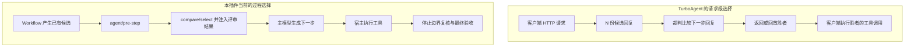
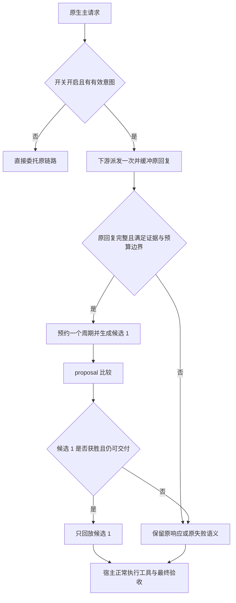

# Agent Note: 过程比较、智能路由与工具阶段语义改进方案

Status: proposed

修订：2026-09-13。根据后续讨论，将受控 `llm/stream` 选优列为主线实现项；用户已明确要求独立开关控制、默认关闭。本文件是本轮完整实施依据，沿用原 P01–P06 编号，执行顺序见第 2 节。

## Problem

前几轮验收关闭了已报告的路由状态机、证据边界、宿主接线、统计与失败记账问题，但没有证明当前过程策略等效于 TurboAgent，也没有完成真实任务的收益评测。本方案承接上一份智能路由策略计划，集中处理本轮发现的指标解释错误、阶段判据错位、早评审覆盖不足，并交付默认关闭的请求级选优能力。真实任务评测决定后续扩大范围与是否建议启用，不替代最小受控实现本身。

### 核对基线与证据

| 对象 | 本次核对基线 | 可据此确认的范围 |
| --- | --- | --- |
| 本项目 | `14546af`，开始编写时工作区干净 | 当前五个工具与生命周期钩子的实现 |
| TurboAgent | `31ea8dadc00211b96544d3edd02ded1ef64e9856`，本轮评审已核对其 main | HTTP 代理、并行回复生成、筛选与后台进度观察 |
| npm 锁定宿主 | 本机安装的 `dsh-llm/agent/session` 均为 `0.1.1-rc.2` | 声明及实现存在 `llm/stream`、`agent/pre-step` 等契约 |
| 同级 DSH checkout | `2377c272a8`；所查 LLM 与 agent-loop 文件无工作区差异 | 新宿主实现也经 `llm/stream` 派发，包括 prepared-call 路径；不代表已验证所有受支持发行版 |

本轮只使用源码核对、历史记录和假模型/离线样例：

- `sigmoid(0.018) = 0.5044998785`，`sigmoid(0.544) = 0.6327424281`。这些是 Bradley–Terry 软偏好权重，不是实测选对率。即使分差为 1，映射也只有约 0.7311；引擎按分数排序选择，不按这个概率抽签。
- README 将上述数值列为“单次比较胜率”，相关 Agent Note 据此认定难分候选接近随机，并以 `gap >= 0.15` 作为重新评估的条件。这个解释不成立。同一记录中的 `10/10` 方向正确率也只能描述那两个固定候选对，不能外推总体可靠性。
- 三次纯读取/检索、没有其它产物或路由信号的任务，在 smart 下返回 `no-consequential-work`；切换 research/writing 判据并不会改变该门槛。
- 两个普通 Subagent 输出无法直接产生结构化路由，只会给停止边界的语义分类提供线索。已有 `pre-step` 早评审只接可信 Workflow 候选。
- `best_of_n` 的生成请求不会自动带入先前会话约束，输入是调用者提供的 `task`，没有执行工具。既有真机笔记记录了草稿因没有实际 stdout/stderr 而在默认 `output_match` 上得零分。

上一轮发布门禁通过和本轮这些离线结果都不是模型效果评测。S05-B 的真实标注样本与对照报告仍待交付。

## Decision

### 1. 接入方式：TurboAgent 如何拦截，我们目前如何工作

TurboAgent 由客户端通过 API base URL 指向其 HTTP 代理。它接收一次请求，保留请求消息和工具定义，产生多个候选回复，评审后向客户端返回选中的完整回复；流式接口回放胜者。候选中的工具调用在选择之后由客户端执行，代理不会先执行 N 套工具轨迹再择优。

本插件目前使用宿主内事件和显式工具，没有注册 `llm/stream` 监听器，也没有 HTTP 代理：

| 接入点 | 当前行为 | 对过程比较的实际作用 |
| --- | --- | --- |
| `agent/pre-step` | 在下一次主模型生成前，比较已完成的可信 Workflow 候选，并向当前步骤注入消息 | 可以让已有候选的评审影响下一步；此时尚未产生下一条主模型回复，不能直接比较其多个版本 |
| `tools/pre-execute` | 当前仅处理 `exit_plan_mode` 计划预审 | 可以在这次计划操作前介入；不是通用的 N 路动作选择器 |
| `agent/turn-stopping` | Team 检查、结构化/语义路由、进度判断与最终验收 | 主要复核已有轨迹，可能通过 steering 开启同一轮的后续步骤 |
| 五个显式工具 | 主 Agent 或编排器主动调用 | 可以在真正的决策点比较候选；不会自动替换任意模型回复 |
| DSH `llm/stream` | 宿主具备，本插件尚未使用 | 能在输出交给 agent-loop 之前返回替代流，是最接近 TurboAgent 请求级选择的位置 |

确定一条包含两种候选来源的实施主线：

1. 先纠正指标解释和阶段判据，再交付受控 `llm/stream` 下一步回复选优。**它是必做的最小功能，独立开关 `autoProcessSelection` 默认 `false`。** 工程验收完成后仍保持关闭，由用户主动启用。
2. 同时保留已有候选的显式 compare/select 与 Workflow 早评审。已有真实候选优先比较，避免在同一决策点重新生成一组回复。
3. 最终验收继续负责交付判断。过程选优不产生“任务已验收”的结论，也不解除已有最终验收要求。

首版开关只在 smart 模式生效，固定 N=2、每任务最多购买一个过程选优周期。manual/strict 暂不进入这条新路径；设置页说明生效模式。后续是否扩展触发场景，由真实对照决定。

HTTP 代理不是实现过程选优的必要条件。对 DSH 单一宿主，原生 LLM 事件省去 HTTP 协议转换；但回放、取消、调用归属等工作仍然存在。已有 `pre-step` 的通过不能充当请求级替换的验收。

### 2. 批次与完成条件

| 编号 | 优先级 | 工作 | 主要交付物 |
| --- | --- | --- | --- |
| P01 | 高 | 纠正评测指标与使用建议 | 文档勘误、可复现的指标定义、更新后的实验准入条件 |
| P02 | 高 | 分开未执行候选与交付验收的判据 | 阶段契约、工具/路由接线、基线验收不被弱化的回归 |
| P03 | 高 | 让可信过程候选在实施前被使用 | Workflow 协议增量、Subagent 聚合配方、早入口回归、生成上下文边界 |
| P04 | 中 | 改善反馈并减少无信息续步 | 有证据引用的简短诊断、smart 下同一停止边界转最终验收的受控验证 |
| P05 | 高 | 补齐任务覆盖及真实收益评测 | 与 S05-B 共用的真实样本、标签、执行对照和错误案例 |
| P06 | 高，主线 | 实现默认关闭的原生请求级选优 | 独立开关、受控触发、N=2 流选择、预算与失败回退、两宿主契约验收 |

#### 交付顺序与依赖

| 批次 | 范围 | 退出条件 |
| --- | --- | --- |
| M0 | P01、P05 的标签/基线准备、P06 的宿主契约验证 | 指标口径正确；确认请求归属、独立派发和原样回放的接入方式；列明发行版差异 |
| M1 | P02 | proposal/artifact/final 分工落地；既有显式调用契约与最终门控回归通过 |
| M2 | P06 最小受控实现 | 默认关闭；开启后确定性触发；N=2 选择、回退、记账和双宿主检查通过 |
| M3 | P03、P04 的反馈部分与调度试验 | 已有候选优先、上下文一致、重复购买受限；smart 调度变化有独立验证 |
| M4 | P05 完整对照与收尾 | 样本、运行配置、结果和错误案例齐全；对各项行为给出保留/回退结论 |

M2 排在进一步扩展停止边界规则之前。M0 的真实数据收集不阻塞假流工程验证；缺真实样本时不能宣称 M4 完成。工程可用、用户启用、效果已验证是三个独立状态。

#### 五工具与新入口的职责

| 入口 | 候选来源与用途 | 验收含义 |
| --- | --- | --- |
| `verifier_compare` | 已有两份同题方案/产物，在决策点按阶段比较 | 相对选择，不代表任务完成 |
| `verifier_select` | 已有三份及以上同题候选 | 锦标赛偏好排名，不拿 shares 当绝对验收分 |
| `verifier_track` | 有真实检查点的过程观察和缺口反馈 | 不能单凭分数替代最终验收 |
| `verifier_best_of_n` | 显式起草文本候选，排序后强制基线检查 | `passesThreshold` 仍只来自最后的基线检查 |
| `verifier_current_session` | 当前任务交付证据复核 | 按既有逐项阈值及范围新鲜度判断 |
| `llm/stream` 受控入口 | 从同一主请求产生原回复与一份备选回复，决定下一步 | 原生内部能力，不新增第六个工具，也不自动调用 best_of_n |

本文件只安排与这些职责直接相关的改动，不把已经验收的统计修复、评分算法变体或宿主兼容分支重新列为重构任务。

### 3. P01：纠正指标解释

#### 实施

- 将 README 的 63.3%/50.4% 明确改为“Bradley–Terry 软偏好权重”，保留原始分差和固定候选对的方向计数；移除据此推出“接近抛硬币”的表述。
- 对已实现的 best-of-N Agent Note 追加有日期的勘误，保留历史决定的来源；同步修改 AGENTS 中沿用错误推断的“可信区间”和固定 gap 条件。分差本身不是统计置信区间。
- 区分：固定候选对方向正确率、跨任务选择正确率、平局率、重复结果稳定性、分差、成本。多裁判 `agreement` 也只表示裁判间一致程度，单裁判为 1 不代表正确率 100%。
- 不再以 `gap >= 0.15` 或是否支持 logprobs 单独决定能否进行过程选优。explicit-tag 与 top-logprobs 分组实测，使用任务结果、重复稳定性和成本做决定。
- 核对同一使用章节中的旧参数、调用次数与术语，限于本轮工具使用说明，不开展无关文档清理。

#### 验收

能从当前 `bradleyTerry` 与排序实现复算示例；文档不把软权重称为抽样正确率，不以两个固定样例证明普遍有效或无效。本批只改说明，不改评分、温度、重复轮次和阈值，也不为算式增加重复单测。

主要位置：README 的 best-of-N 使用章节、AGENTS 对应条目、既有 best-of-N Agent Note。

### 4. P02：建立明确的评审阶段

#### 阶段定义

| 阶段 | 输入 | 评审问题 | 对最终验收的影响 |
| --- | --- | --- | --- |
| `proposal` | 未执行方案、补丁草稿、拟采取动作或文本草稿 | 是否符合目标与约束，是否可行，是否有适用的验证方法 | 选择结果不能表示已完成任务 |
| `artifact` | 已有产物及可见执行证据 | 当前候选在所选领域判据上表现如何 | 仍是候选比较；相对排名不能当验收结果 |
| 最终验收 | 当前任务实际轨迹与交付物证据 | 是否达到既有逐项要求 | 继续使用固定空工作基线和 `sessionAccepted` |

#### compare/select

1. 两工具增加可选的 `reviewStage: 'proposal' | 'artifact'`。省略时维持既有 artifact 语义，保留所有现有返回字段及意义。
2. proposal 默认使用三个窄判据：目标与约束吻合、方案可行性、验证设计是否适用。对要求执行的任务，区分“拟运行”与“已运行”；对纯文本交付，评估内容及可核对依据，不强制要求终端命令。
3. 显式 `criteria` 继续优先，返回/统计中说明实际阶段与判据来源，避免调用者不知道自己评的是什么。提示词的角色描述随适用任务域调整，不对研究/写作固定使用编码 Agent 的描述。
4. 阶段和实际判据写入提示词与路由 fingerprint。相同候选从 proposal 变成带真实证据的 artifact 后可以重新评审，同一阶段与同一证据跨入口仍只评一次。显式复核去重键也要携带同一阶段语义，省略 reviewStage 的旧调用按 artifact 处理；不能让一次 proposal 比较屏蔽后续 artifact 比较。
5. `winner/index/ranking` 保留数值排名意义。自动反馈区分“评分较高”与“已证明更可靠”，展示分差、可用的分项依据；不凭空增加一个固定近似平局阈值。

#### best_of_n

本方案明确提出一项产品规则调整：**默认草稿筛选与最终基线检查可以使用不同阶段的判据，但基线检查继续强制执行。** 这需要在实施 P02 时同步修订 AGENTS 中“两次比较共用判据”的现行规定，不能保持旧契约说明后暗改实现。

- 未提供显式 `criteria` 时：草稿排序使用 proposal 判据，胜者与 `EMPTY_WORK_BASELINE` 的比较继续使用当前配置的交付判据。
- 已提供显式 `criteria` 时：继续让该自定义判据作用于两次比较，保持现有调用者对该参数的控制权，并回显实际判据来源。
- 现有 `score/criteria/threshold/passesThreshold` 继续只描述最后的基线检查；新增的排序阶段信息单独表达。即使 proposal 排序很好，缺少最终验证证据仍可能 `passesThreshold: false`。
- 输出说明这些候选由文本生成而来、没有通过本工具执行。不得将 proposal 分数代入 `sessionAccepted`，也不得让本工具清除会话的自动验收要求。
- 成本预估分别计算排序判据数和最终判据数，不再假设两阶段永远相等；基线快照保留 `baseline:` 标签。

#### 验收

- 两个未执行方案可以按可行性与验证设计比较，不能仅因为没有 stdout 就被过程判据一律判失败。
- 同一份候选随后带来失败测试，artifact/最终验收必须看见新证据，不能复用 proposal 的通过含义。
- 默认调用、显式自定义判据、混合阶段缓存、取消及部分裁判失败都保持现有契约；新增字段通过真实工具 output schema 校验。
- 五工具数量不增加，最终门控的基线、逐项阈值和 freshness 规则不放宽。

主要位置：`core.ts`、`engine.ts`、`index.ts`、`router.ts`、对应测试、README 与 AGENTS。提示词变化自然使旧评分失效；若实际改变缓存身份字段，按现行规则升级 cache version。

### 5. P03：把候选比较放到真正的实施之前

#### 可信候选接入

- 保留现有 Workflow v1 协议；新增版本明确携带组级 `reviewStage`、同一决策的 groupId，以及可核对的任务范围/来源引用。`status: completed` 只表示候选生产完成，不能推断代码已执行成功。
- 首个完整用例采用已有 Workflow 聚合同题 Subagent 结果：父编排器明确指定同一任务的两种方案，收齐输出，导出候选信封，由 `pre-step` 比较，再由主 Agent 实施。
- 同时提供“已有两份候选直接 compare、三份及以上直接 select”的过程使用示例。使用时机包括关键方案选择、修复路线分歧、重要中间产物，不再笼统限定为最终交付物。该入口已评审或仍在评审同一决策时，P06 不再生成备选回复。
- 普通 Subagent 的直接自动早评审，需要宿主提供可核对的同组元数据。只有子 Agent 在返回文本里自报 groupId，不能建立信任；取得不到元数据时使用父 Workflow 聚合，停止边界语义识别继续兜底。
- 不在 `pre-step` 无条件新增分类调用。拒绝/取消/被清空的步骤继续保持原状，沿用现有预约、双入口去重和最终预算保留。

#### best_of_n 的必要上下文

- 增加可选 `context` 文本参数，传入与本次候选有关的仓库约束、接口、文件摘录和已知事实；省略时保持仅 task 的既有输入行为。
- task 与 context 脱敏后共同受显式总量限制，同时对每项限长；context 作为数据包在内容派生的分隔块中，不提升为额外系统指令。
- 所有草稿与两次评审看到同一份上下文，不能只给生成模型或只给裁判。记录省略信息，不能默默把缺上下文造成的失败算成候选质量不足。
- 不自动拼接整段系统提示词、完整会话或密钥配置。需要真实执行、工具交互的候选继续交给 Workflow/Subagent，文本生成工具不伪装成执行器。

#### 验收

用真实宿主形状的假流锁定：同题候选先评审、结果进入下一步主模型请求；不同子任务不误归组；新任务消息不被旧候选介入；相同输入在早入口/停止入口不重复购买；过期结果不注入。上下文标记在所有草稿及评审请求中一致可见，省略参数时请求保持既有范围。

记录“评审完成早于首次采用候选的操作”所需的事件位置；实际是否采纳及采纳是否有效由轨迹/样本判断，不能仅因发出了 steering 就计为收益。

主要位置：`router.ts`、`index.ts`、`caller.ts`、`core.ts`、使用示例与宿主接线测试。

### 6. P04：反馈要能指导下一步，进度观察要减少无效续步

#### 反馈

- 在现有裁判调用中返回至多三项简短诊断：涉及的判据或检查点、具体缺失/失败、已经提供给裁判的证据引用、建议验证动作。保持现有评分标记可解析，不额外购买一轮“解释模型”。
- 诊断引用只能来自实际渲染过的证据；无诊断或引用无效时明确说明定位信息不足，不编造原因。评分解析继续 fail closed。
- 从正式结构化结果生成反馈，不将只供人查看的 DecisionTrace 快照接入判定路径。反馈继续遵守 4000 字符上限。

#### smart 调度试验

目前 track 完成与未完成都会 steering。试验改为：track 先作为观察记录；有具体且可定位的未完成项时才要求针对性续步；已经完成，或只有低分而没有可用诊断时，在需要最终验收的任务上进入同一停止边界的 final 检查，省去一次只有泛化提示的主 Agent 续步。

这不是自动放行：track 成功后已经设置的最终验收要求必须保留，进入 final 前重新读取路由状态，继续执行既有预算、取消和 freshness 检查。strict 暂不引入这项新调度；观测曲线也不宣称为逐步在线估计。

#### 验收

同一任务对照记录主 Agent 额外步骤、重复评分、最终误阻断和总 token。低进度不跳过必须进行的 final，诊断不足不产生伪修复指令，任何 steering 均有预算来源；证据读取/解析失败沿用已修复的门控路径。只有对照结果支持时才采用该 smart 调度。

主要位置：`core.ts`、`engine.ts`、`auto.ts`、`index.ts`、`statistics.ts` 与相关测试。

### 7. P05：覆盖率与真实收益评测

本项直接完成既有 S05-B，不另建一套评测平台或把样本说明文件算成交付。

#### 数据与对照

- 首批约 30 条脱敏真实任务用于发现问题，覆盖代码、研究、写作、同题候选/不同子任务、长任务、纯对话；固定候选对的重复次数与独立任务数量分别报告。
- 预先标注应否评审、候选分组、评审阶段、合适介入点、最终要求是否满足。标签依据产物与真实证据，不依据裁判分数反向标注。
- 对照分为四组：manual；冻结的当前 smart；阶段/早评审改进且过程开关关闭；同一改进版本且过程开关开启。最后两组隔离 P06 的增量效果，不能把所有改进合并后归功于请求级选优。
- 模型、通道、判据、预算等变量分别固定；变更阶段判据的实验单列。先在约 6 条有真实恢复需求的任务上做小规模配对运行，再扩展到约 30 条分层样本；样本预先选定，失败案例保留。
- 阈值/解析回放只能验证历史记录及调度；早反馈是否改变后续实施，必须用重新运行任务的对照确认。

#### 指标

报告路由 precision/recall、阶段选择正确性、候选选择正确率和平局率、重复测量稳定性、最终误放行/误阻断/未验收退出、首次正确方案出现时间、返工和主 Agent 续步数、总模型请求与已知 token、P50/P95 延迟。P06 单列触发率、跳过原因、备选胜出率、有效替换率、重复/相同候选率、回退率、从请求开始到首个可见输出的延迟。备选胜出不等于最终质量提升。失败缺失用量单列；explicit-tag、top-logprobs、裁判降级分组报告。

#### 研究与写作覆盖

先确认“不产生写入但交付重要研究结论”等漏检样本，再为可识别的任务/交付信号增加窄触发规则。纯对话继续作为免检对照；不能只因为切换了 research/writing 预设，就把所有聊天都强制验收，也不能把写文件当成重要性的替代指标。

#### 完成条件

真实样本、标注依据、运行配置、报告和错误案例均可复查；每项行为变更都有基于数据的保留/回退结论。P06 工程完成仍保持默认关闭，只有数据支持才建议特定场景启用。试验前登记可接受的额外 token/延迟与回归判据；收益不足则继续关闭，不能以备选胜出率替代收益。30 个样本不足以保证低错误率，报告必须保留样本量与不确定性。自动验收阈值、路由置信度和重复轮次在证据不足时不调整。

真实模型试验开始前明确数据、模型与总调用/token 预算；制定本方案本身不代表已执行或已授权无限量模型实验。

### 8. P06：实现默认关闭的原生请求级选优

本项交付一个可以在受支持宿主上实际运行、由开关控制的最小功能。工程实现列入主线；扩大触发范围、提高 N 或建议默认启用均不属于首版。

#### 8.1 开关与首版范围

| 项目 | 决定 |
| --- | --- |
| 配置 | `autoProcessSelection: boolean`，默认 `false`；设置页名称“过程选优（受控）” |
| 关闭行为 | 立即委托原有 `next()` 链路，不新增候选、裁判调用、响应缓冲或过程记录 |
| 生效模式 | `enabled` 且 smart 且开关开启；manual/strict 不进入新路径，UI 说明限制 |
| 候选数量 | 固定 N=2：原回复为候选 0，新增一份为候选 1；不增加 N 的设置项 |
| 次数上限 | 每任务最多购买 1 个过程周期，并受现有任务/会话路由额度及模型调用预算共同限制 |
| 初始触发 | 同一任务中最近两次已完成的验证运行均有明确失败状态，且该失败信号尚未消费 |
| 生成模型 | 使用原主请求的模型及生成配置；裁判仍使用设置中配置的裁判 |
| 最终验收 | 过程选择不等于验收；选择结果被交给宿主后，最终验收仍必须覆盖随后产生的实际工作 |

新安装或旧配置缺少该字段时默认关闭；用户显式保存的开关状态在重启后原样恢复。不得因安装、升级、评分较高或一次实验成功自动打开。新增配置必须同步 Config、resolveConfig、设置 UI、中英字典、README 和相应验证。

初版只自动处理上述故障恢复场景。架构分歧、用户泛称“重要”、单次工具失败或模型自述“卡住了”，不直接购买 N 路生成；这些场景先使用显式 compare/select 或可信 Workflow。后续扩大触发范围必须有 P05 样本支持。

验证运行沿用现有证据识别入口，失败要求真实 tool/result 或 PTC 结果的错误状态；仅出现文本“FAIL”、历史失败日志或命令中包含测试名字不够。两次中若有一次成功验证，失败链断开。无法明确识别时按未触发处理，不能为确认触发再增加一轮分类模型。

#### 8.2 与已有入口的调度顺序

1. `agent/pre-step` 先尊重最终 waterfall 决定；拒绝、取消、新直接用户/Team 任务、被清空的继续消息不产生过程选优意图。
2. 先处理已有可信候选的早评审。已有同一决策的显式比较、早评审结果或评审在途时，不再让当前请求购买 P06。
3. 满足故障恢复条件才为下一次真实主请求登记一次意图，包含 Agent、任务起点、turn/step 和失败证据引用；意图不等于已购买，不调用模型。
4. `llm/stream` 将意图与真实请求身份绑定，检查当前模式、开关、任务、预算和能力；不匹配就原样放行，过期意图不得流入另一任务。
5. `tools/pre-execute` 继续保留原有参数校验、权限与计划预审；过程选择不跳过这些步骤。停止边界继续执行既有最终验收。

已有候选与新生成的下一步回复是不同对象，去重需要任务/决策归属，不能仅凭工具名屏蔽整类路由。对于无法证明同一决策的情况，首版采用“当前 pre-step 已有评审结果则不再购买 P06”的窄规则。

#### 8.3 请求归属与递归隔离

- 已核对的锁定依赖与本地宿主均公开 `llm/stream(options, next)`，主请求有 `isAgentLoopRequest(options)` 标记、`sessionId`，并且 deep-frozen。prepared-call 路径也经此事件。
- 使用原生请求标记、显式 sessionId、已登记的活跃 Agent/任务意图共同匹配。`currentInitiator()` 只作一致性核对，不能单凭环境归属推断授权；缺归属时跳过，不像看板探针那样借用最新会话。
- 裁判、语义分类、探针、best_of_n、标题/压缩与其它辅助请求不匹配主请求意图。新增候选使用独立请求对象，不复制进程内主请求标记；本插件再用请求局部标记避免嵌套拦截，不用全局布尔开关影响其它 Agent。
- 一次原请求的 `next()` 只调用一次。新增候选通过受支持的独立调用生命周期派发，不复用 prepared-call，不直接调用 provider 私有方法。
- 设置变更、新任务、取消和宿主关闭均使尚未消费的意图失效。同一周期冻结评分配置，不能把前半段与后半段按不同裁判/判据计算。

本次仅核对了 0.1.1-rc.2 与本地 checkout。M0 必须在实际目标 0.1.5 发行版证明相同的调用归属和生命周期，不能仅凭类型声明宣布兼容。

#### 8.4 生成、比较与回放

- 先完成原回复，再生成一份备选。首版采用这一顺序以保留明确的原回复回退路径，并避免给不适合比较的原响应额外付费；其串行等待计入效果评测。
- 候选 1 保留原请求的 `system/messages/tools/provider/model/reasoningEffort/temperature/maxTokens/stop` 等有效配置，使用自己的取消信号和调用生命周期。不得套用 best_of_n 的温度 1.0、裁判温度或文本起草模板；不得就地修改冻结请求。
- 生成侧仍是同一主模型的完整请求。裁判侧另建脱敏、限长的比较视图，包含任务、约束、最近失败证据、两份候选的文字/工具名/参数以及相关工具定义；全部数据通过确定性分隔块处理。
- 复用 `itemBudget()` 分配候选预算，并按实际渲染文本计算总量。工具名和参数是动作整体，不能截断后当成完整动作评分；任务必要约束或候选动作放不下时回退原回复，记录具体限长原因。
- 比较视图忽略传输层 callId、usage 等无关字段，保留文字及动作内容。规范化后的两候选相同则跳过裁判，保留原回复并如实记为重复候选；不得把新 callId 误当成新方案。原始待回放数据保持不变。
- 原回复与备选按 A/B 输入现有 compare，引入 P02 的 proposal 判据，沿用自动 compare 的偶数轮换位与裁判聚合。只有结果选择备选时才替换；原回复胜出、并列或相同时保留原回复，不声称它因此通过质量验收。
- 缓冲原始 StreamChunk 并只回放一个完整胜者，保持块顺序、工具身份、参数、finish、reasoning/replay 元数据。不能把文字重新包装成流后丢掉宿主需要的状态，也不能直接用现有纯文本 generateCandidate 代替此路径；只有 tool-call 的合法回复不能被判为空文本。
- 每份候选缓冲设有限上限，首版为 1 MiB。原流超限时退出选优，按原顺序排出已缓冲内容并继续原迭代器；不能再选另一候选。备选超限则停止备选并回退完整原回复。
- 首版先验证文字与 tool-call 路径；图片或其它块、provider-owned replay 状态必须有无损回放证明后才纳入。无法可靠处理时保留原路径，不能按厂商名称假定支持，也不能静默删除未知块。
- 尚未决定胜者时不把任何候选 token/tool-call 暴露给宿主；已开始回放后不允许切换候选。宿主正常提交 assistant 消息和执行工具，本插件不手动追加虚构的会话执行事件。

新增生成和比较共用一个增量阶段截止时间，首版复用现有 `timeoutMs` 作为该阶段总上限；重试不能重置总截止时间。它不缩短原本主请求的超时，也不通过重发原请求来实现回退。

#### 8.5 预约、最终验收与计费

在发出候选 1 之前，使用 AutoVerifierRouter 预约一个 `process` 周期；这是内部 RoutePhase 增量，公开的四类路由工具与五个显式工具集合不变。失败、并列和重复候选均消耗已经购买的周期，不能用重试再次购买。

设过程判据数为 C、过程比较轮次为 R、裁判数为 J：

| 口径 | 计算方式 | 默认示例 |
| --- | --- | --- |
| 原本主模型请求 | 原链路已有调用，不算插件新增调用 | 1 |
| 过程额外逻辑调用 | 1 份备选 + C × R × J 次裁判 | C=3、R=2、J=1 时为 7 |
| 最终验收保留额度 | 最终判据数 × 最终轮次 × J | 默认 6 |
| 请求尝试 | 各调用实际尝试及重试；与逻辑调用分开 | 依当前重试配置和失败情况记录 |

过程新增调用消耗现有任务/会话模型预算，并且在预约时保留 final floor；路由尝试和最终验收尝试仍各自独立。预算不够时在新增请求之前回退原路径，不上调默认 96/240 预算，也不做本轮未要求的自动退款。

每任务 1 次的过程额度覆盖失败与取消的已购买周期。复用话题统计侧车登记 cycleId、任务起点和已消费失败信号，在新增调用前写入开始记录；重载后恢复该消费事实，不只依赖会丢失的内存计数。记录读取/登记失败时不购买额外调用，按原路径继续并报告原因。

成功比较且结果即将交给宿主时，消费预约并设置该任务的最终验收要求。即使保留原候选也不表示任务完成；回退不能清掉已有 finalRequiredFromSeq。取消或结果过期不记为已交付。

统计至少区分：原请求、额外生成、裁判；已触发、已比较、实际回放了哪份、选优未完成。备选胜出仅代表替换决策，不能算成已经执行或质量提升。

原回复由宿主计费一次。插件单独记录额外生成与裁判用量，候选角色与所选编号作为关联信息；不得把胜者的 usage 与所有候选 usage 同时作为两份总费用相加。缺失用量、失败前已知 token、取消期间在途用量及重试继续使用已修复的累计机制。主模型与裁判单价可能不同，优先分别报告 token；无法取得对应价格时标为估算/未知，不伪装成准确美元成本。

#### 8.6 失败与退出语义

| 情况 | 行为 |
| --- | --- |
| 开关关闭/模式不适用/未触发/宿主能力不足 | 原请求只经原链路一次，不生成备选 |
| 原请求自身失败或不完整 | 保持宿主原失败/重试语义，不拿另一条路径伪装原请求成功 |
| 备选失败、超时、超限，或裁判解析失败/整组失败 | 停止额外工作、汇总用量，回放已取得的有效原回复；记选优未完成 |
| 候选并列/相同 | 保留原回复，分别记录 tie/identical，避免伪造唯一赢家 |
| 用户取消、任务切换或快照已不再适用 | 取消所有子请求，不把迟到结果交给新任务；统计不是成功交付 |
| 运行中关闭开关 | 取消尚未交付的额外工作，使用可用原回复；已开始回放的候选不在半途切换 |
| 过程中预算不可用 | 不发新增请求；已消耗部分如实记账，最终验收额度继续独立 |

这里的回退表示没有完成选优，符合 smart 继续原任务的行为；它不是解析失败后赋分，也不是验收通过。显式 best_of_n 少于两份候选即报错的既有契约保持独立。

#### 8.7 高风险验收矩阵

| 关键路径 | 必须证明的结果 |
| --- | --- |
| 默认/关闭 | 同一改进版本中与未启用 P06 的路径一致：下游一次、无额外模型调用、无新增缓冲或过程记录；设置完整落盘 |
| 连续失败触发 | 两次真实失败才产生意图；成功验证、新任务、同信号消费或其它候选评审会正确中止/跳过 |
| 并发与归属 | 两个 Agent 的请求不串票；同一任务不超额；辅助请求即使有相同 sessionId 也不触发 |
| prepared-call/递归 | 原下游只派发一次；备选独立生命周期；裁判、探针、草稿不递归；不得消耗错误的 replay 游标 |
| 候选选择 | 原胜、备选胜、tie、identical 四种结果可核对；只有胜者的工具有机会执行 |
| 流与身份 | 原样保留 tool-call/参数/finish/replay 状态；未选中的工具执行次数为 0；会话无重复消息 |
| 缓冲边界 | 恰好上限、超一单位及超限后原流续传均不丢块、不重放两次、不切换半条回复 |
| 取消/设置变化/晚到结果 | 原任务正确退出，无跨任务注入；已开始回放后不拼接另一候选 |
| 预算与记账 | 预约上限、final floor、默认 7 次增量示例、缓存命中、重试、部分失败和未知费用均符合定义 |
| 最终验收 | 过程胜者实施后仍验收；未执行动作和失败回退不能清除最终要求 |
| 两条宿主线 | 锁定依赖与实际目标 0.1.5 发行版分别通过契约检查；本地类型检查仅作补充 |

M0 若发现公开 API 无法维持请求归属、独立派发或 replay 状态，先给出最小可复现证据与所需宿主接口，再完成兼容实现；不得为交付绕过契约，也不得将全量跳过的空实现记为功能完成。

M2 必须交付可实际开启的受控路径、关闭即回到原行为的开关、上述关键回归和使用说明。M4 另交真实效果报告。结论即使是收益不足，默认关闭仍保留，后续是否扩大适用范围单独决定。

主要位置：新增职责集中的 `src/process-selection.ts` 及同目录测试；在 `index.ts` 接线，复用 `router.ts` 的预约与证据、`engine.ts` 的比较、`caller.ts` 的取消/累计、`statistics.ts` 的侧车记录。仅按实际需要增加这些模块的字段和小型接口，不创建通用流拦截框架。

### 9. 实施与发布纪律

- 每批用独立 Agent Note 记录实际行为、备选与验收。P06 最小受控功能是本轮工程交付项，不能仅交可行性报告；真实收益验证单独在 P05 完成。所有工程批次和真实评测结束前，当前总计划保持 proposed，逐批记录已完成部分。
- 复用现有引擎、预约、trace 与统计；不为方案引入通用中间件平台、自动多模型编排或新的 HTTP 服务。
- 改工具输出时同步 schema，并让真实返回值过 schema 回归。新增用户配置必须同时更新 schema、resolveConfig、UI、中英字典和 README。
- 源码变更运行 `pnpm run verify:release` 并同步 `lib/`；涉及宿主接线补 `typecheck:local` 与目标发行版契约验证。所有日常测试使用假模型，不发真实网络请求。
- P02/P03 的阶段指纹、显式与自动去重、最终验收保留额度、手动验收 freshness，以及 P06 的请求隔离/回放/费用是重点回归；不重写已通过的算法或重复增加低价值测试。
- 任何回退保留真实统计与实验数据。P06 首先通过关闭开关退出，不能回放半条回复后换候选；P04 调度收益不足恢复原调度；不能通过放宽最终验收规则掩盖失败。
- P06 新增内部 `process` 阶段及其最终验收要求，要同步 AGENTS 的阶段清单与预算解释；P02 的 best_of_n 判据调整同步修订同判据条款。两项都是本计划显式提出的产品变化，不能留着旧规约让后续实现相互冲突。
- 每批交付说明必须列出改动文件、实际执行的检查和未完成项。仅编写/修订本 Markdown 时检查结构、链接与内容一致性，不运行与文档无关的完整发布门禁。

### 10. 证据与相关计划

- [上一份智能路由策略改进计划](C:/Users/A/Documents/dsh-llm-verifier/.agents/notes/proposed/architecture/2026-09-13-smart-routing-strategy-improvement-plan.md)：S01–S04 已实施部分作为基础，S05-B 在本方案 P05 继续。
- [上游对照计划](C:/Users/A/Documents/dsh-llm-verifier/.agents/notes/proposed/architecture/2026-09-13-upstream-routing-tools-review-plan.md)：已关闭的 F 项不重新列为缺陷。
- [本地评分公式与阶段判据](C:/Users/A/Documents/dsh-llm-verifier/src/core.ts)、[路由](C:/Users/A/Documents/dsh-llm-verifier/src/router.ts)、[工具和钩子装配](C:/Users/A/Documents/dsh-llm-verifier/src/index.ts)、[门控与反馈](C:/Users/A/Documents/dsh-llm-verifier/src/auto.ts)。
- [既有 best-of-N 决策记录](C:/Users/A/Documents/dsh-llm-verifier/.agents/notes/implemented/feature/2026-09-13-best-of-n-generation-side-selection.md)：P01 勘误与 P02 产品规则变更的原始出处。
- [TurboAgent 请求管线](https://github.com/llm-as-a-verifier/TurboAgent/blob/31ea8dadc00211b96544d3edd02ded1ef64e9856/turbo_agent/proxy/backend.py#L165)、[工具调用的候选表达](https://github.com/llm-as-a-verifier/TurboAgent/blob/31ea8dadc00211b96544d3edd02ded1ef64e9856/turbo_agent/proxy/backend.py#L346)、[后台进度](https://github.com/llm-as-a-verifier/TurboAgent/blob/31ea8dadc00211b96544d3edd02ded1ef64e9856/turbo_agent/progress_monitor/monitor.py)。
- [DSH 本地 LLM 事件契约](C:/Users/A/Documents/deepseek-harness/packages/llm/llm/src/index.ts:59)、[prepared call 单次派发](C:/Users/A/Documents/deepseek-harness/packages/llm/llm/src/index.ts:943)、[主循环消费流的位置](C:/Users/A/Documents/deepseek-harness/packages/core/agent-loop/src/agent.ts:379)。这些是所查 checkout 的证据，不承诺所有发行版实现相同。

## Alternatives considered

1. **直接复制 HTTP 代理。** 本轮不采用。DSH 已有原生 LLM 拦截契约；增加 HTTP 服务还需处理 API 格式、认证路由和部署。只有未来明确要求同时服务多个客户端时再评估该层。
2. **立即给每次主模型请求做 N 路生成。** 不采用。交付默认关闭、N=2、每任务一次的受控实现，用户开启后也仅在已定义的场景触发；全量接管不在本轮范围。
3. **仅继续扩大停止边界的规则。** 不采用为唯一主线。它无法解决候选选择晚于实施的问题，也无法替代下一步回复筛选。
4. **用更低阈值、更多裁判或强制 logprobs 消除所有问题。** 不采用。它们不能补齐阶段语义和调用时机，且不同评分通道都需要任务级验证。
5. **删除 best_of_n 的基线检查以减少调用。** 不采用。相对排序不能提供最终验收含义；P02 只分开默认排序判据，最终基线与其字段含义保留。
6. **把普通 Subagent 的所有输出都当成同题候选。** 不采用。父编排器要建立真实分组关系，否则继续使用现有保守识别。
7. **把任意低进度分数都变成继续工作的命令。** 不作为新方案的目标。先补可定位反馈，通过任务对照判断是否值得控制续步。
8. **把 llm/stream 长期留成可选研究项，或默认开启后再观察。** 不采用。用户已选定开关控制且默认关闭；本轮完成最小受控实现，工程验收与效果评测分别交付。

## Consequences

采用本方案后，工具的数值输出会明确对应其评审阶段，过程比较可以更早影响实施，最终验收仍要求真实证据。P01 纠正错误的产品论证，P05 决定哪些新增控制行为值得保留。

P02 对 best_of_n 默认排序判据的调整是有意的产品变化，可能改变候选排名，必须单独验收并更新既有规约；它不等于放宽基线验收。P03 的阶段元数据与上下文会增加输入，需要继续执行已有双层上限。

P06 将以独立开关、默认关闭的受控功能交付。关闭时保持原请求路径；开启且实际触发时增加候选生成和等待延迟，输出要等选择完成或回退后才可见。其优势和代价都必须用实际任务确认，不能由宿主钩子存在或算法公式推导出来。

本文件的交付是改进方案与已核对的接入契约，不代表 P01–P06 已实施，也不代表 S05-B 已完成。
