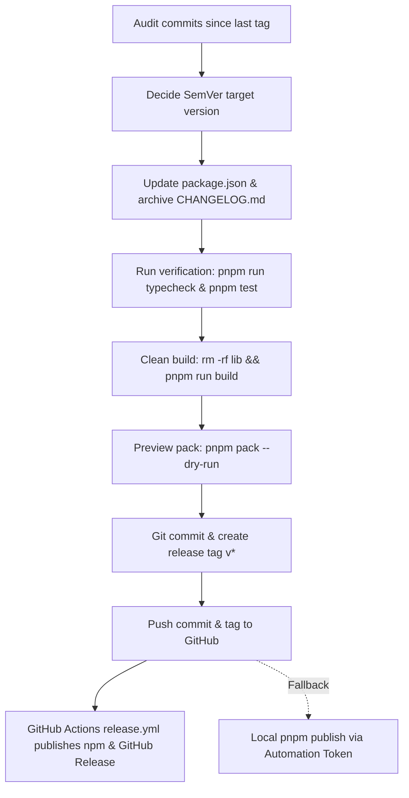

# dsh-llm-verifier Release Procedure & Skill

This skill documents the standard operating procedure (SOP) for releasing versions of `dsh-llm-verifier`. It covers commit auditing, SemVer decisions, CHANGELOG archiving, pnpm-based verification, clean build enforcement, Git tagging, automated CI publishing, and local fallback publishing.

---

## 1. Release Flow Overview



1. **Commit Audit & SemVer**: Compare commits from the last release tag to `HEAD` and determine the version number.
2. **Version & Changelog Sync**:
   - Update `"version"` in `package.json`.
   - In `CHANGELOG.md`, move items under `## Unreleased` into a new `## <version> - YYYY-MM-DD` section, leaving a fresh `## Unreleased` placeholder above it.
3. **Verification & Clean Build**:
   - Run `pnpm run typecheck` and `pnpm test`.
   - Wipe `lib/` and rebuild (`rm -rf lib && pnpm run build`) to ensure clean compilation.
   - Run `pnpm pack --dry-run` to preview published files.
4. **Git Commit & Tag**:
   - Commit changes: `git commit -m "chore(release): bump package version to <version>"`.
   - Create tag: `git tag v<version>`.
5. **Push & CI Publishing**:
   - Push to GitHub: `git push origin main --tags`.
   - The `.github/workflows/release.yml` workflow triggers on `v*` tags, extracting release notes from `CHANGELOG.md`, publishing to npm via `secrets.NPM_TOKEN`, and creating the GitHub Release.

---

## 2. Step-by-Step Procedure & Commands

### Step 1: Audit Commits & Determine Version

```powershell
# 1. Find the latest release tag
git describe --tags --abbrev=0

# 2. View commits since the last release tag
git log $(git describe --tags --abbrev=0 2>$null || "HEAD~10")..HEAD --oneline
git status
```

### Step 2: Update package.json & CHANGELOG.md

1. **Update `package.json`**:
   Change `"version": "x.y.z"` to the new version.

2. **Archive `CHANGELOG.md`**:
   Rename the current `## Unreleased` contents to `## <version> - YYYY-MM-DD`:
   ```markdown
   # Changelog

   ## Unreleased

   ## <version> - YYYY-MM-DD

   - **[Feature/Fix] Title (#Issue)**
     - Details...
   ```

### Step 3: Verification & Clean Build

```powershell
# 1. Typecheck
pnpm run typecheck

# 2. Run tests
pnpm test

# 3. Clean build
if (Test-Path lib) { Remove-Item -Recurse -Force lib }
pnpm run build

# 4. Pack dry-run to verify included files
pnpm pack --dry-run
```

### Step 4: Git Commit & Tag

```powershell
# 1. Stage release metadata
git add package.json CHANGELOG.md

# 2. Commit with conventional prefix
git commit -m "chore(release): bump package version to <version>"

# 3. Tag with v prefix (must match v* for GitHub Actions)
git tag v<version>
```

### Step 5: Push & CI Automated Release

```powershell
git push origin main
git push origin v<version>
```

---

## 3. Automated One-Command Helper

A release helper script is available at `.dsh/skills/release-plugin/scripts/release.mjs`. You can trigger it via npm/pnpm:

```powershell
# Bump and release a specific version
pnpm run release 0.9.4
```

---

## 4. Local Fallback Publishing (Bypassing 2FA)

```powershell
# 1. Verify npm identity
npm whoami

# 2. Publish via pnpm
pnpm publish --access public --no-git-checks
```

---

## 5. Traps & Invariants

1. **`lib/` Git Tracking**: `lib/` must NEVER be committed to Git; it belongs only in `.gitignore` and `package.json`'s `files` list.
2. **Prerelease Tags**: npm 11+ refuses to publish prereleases without an explicit `--tag <dist-tag>`.
