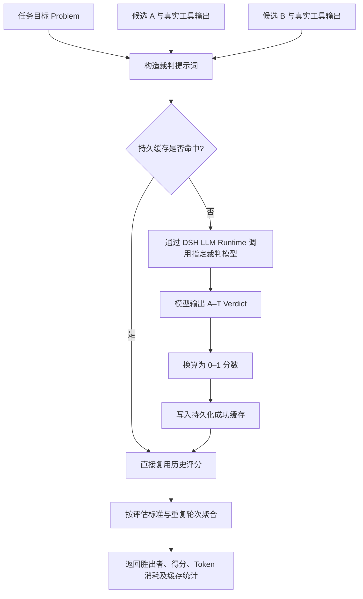

# DSH LLM Verifier

> 基于 [llm-as-a-verifier/llm-as-a-verifier](https://github.com/llm-as-a-verifier/llm-as-a-verifier) 迁移构建的 DSH 原生模型可配置复核插件（Verifier）。

---

## 它是什么？

`dsh-llm-verifier` 为 DeepSeek Harness（DSH）引入了一套**独立的裁判复核机制**。在主 Agent 负责生成代码、执行命令与工具交互的同时，Verifier 会收集当前任务目标、各候选方案过程以及真实的终端执行结果，交由你在设置中指定的独立 DSH 模型进行仲裁：评估哪个方案更可靠、当前任务的实际完成进度、以及是否存在未发现的潜在错误。

插件提供五个显式工具，并支持可配置的宿主级自动会话验收：

- `verifier_compare`：对两个候选执行过程进行成对比较（Pairwise Comparison）；
- `verifier_select`：在多个候选方案中通过锦标赛机制选出最优解，供 Best-of-N / 多候选编排器直接调用；
- `verifier_track`：评估任务在已有检查点（Checkpoint）的完成度与进展，供 Goal / Workflow 等长任务编排器直接调用；
- `verifier_best_of_n`：**唯一会自己生成候选的工具**——用当前会话模型并行起草 N 份完整候选，再用独立裁判排序，并额外给出与验收门控同源的**绝对分**（见[关键交付物的 best-of-N](#关键交付物的-best-of-n)）；
- `verifier_current_session`：显式提取当前 DSH 会话记录，进行脱敏并执行复核；
- **自动路由与早评审**：智能或严格策略在 `agent/turn-stopping` 生命周期边界按阶段调度 `select → compare → track → current_session`（`verifier_best_of_n` 永不自动触发）。第一阶段只信任 Workflow 的版本化候选协议与发生真实变化的 Todo 快照；普通 Subagent 输出必须经第二阶段的证据引用分类，避免把不同子任务误当候选。此外，**智能模式**还会在 `agent/pre-step`（下一次模型生成之前）对已完成的 Workflow 候选信封做一次受限的 `compare/select` 早评审，让选择结果直接影响接下来的实施；该入口不跑语义分类、`track`、最终验收或候选生成，严格模式不参与；
- **自动验收门控**：候选选择与进度检查完成后，宿主运行同一会话验收逻辑；未通过时以插件 steering 反馈要求 Agent 修复并重新验证，而不是依赖模型是否主动想起工具。

## 安装与启用 (Installation & Usage)

### 1. 使用 `dsh plugin` 安装

DeepSeek Harness（DSH）通过 profile 独立管理各个运行环境的插件依赖。请使用 `dsh plugin` 命令将插件安装至目标 profile（如 `web`）：

```bash
# 方式 A：从 npm 官方 Registry 安装（推荐）
dsh plugin --profile web add dsh-llm-verifier
```

> [!NOTE]
> `dsh plugin add` 安装成功后，DSH 会自动识别包内的 `dsh.bundle` 声明并完成插件层自动对齐（Reconcile），**无需手动修改任何配置文件**。

### 2. 启动与配置

启动 DSH Web 客户端：

```bash
dsh web
# 或
dsh --profile web
```

启动后进入前端界面，打开 **`设置 → LLM Verifier`** 即可可视化配置裁判所使用的 Provider、Model、推理强度（Reasoning Effort）、最大并发与缓存策略。

### 3. 常用管理命令

```bash
# 更新插件至最新版本
dsh plugin --profile web update dsh-llm-verifier

# 卸载插件
dsh plugin --profile web remove dsh-llm-verifier

# 查看当前 Profile 已安装的插件与依赖列表
dsh plugin --profile web list
```

### 4. 作为独立库引用（可选）

如果你在其它 TypeScript / JavaScript 项目中需要复用核心评分标尺与锦标赛算法，可直接作为普通 npm 依赖安装并引入：

```bash
pnpm add dsh-llm-verifier
```

```typescript
import {
  extractScore,
  extractProgressScore,
  bradleyTerry,
  pivotRoundPairs,
} from 'dsh-llm-verifier/core'
```

## 本地开发

```bash
pnpm install
pnpm run build      # 生成 lib/，宿主加载的就是这份产物
pnpm run typecheck  # 按 package.json 里锁定的 @deepseek-ai/dsh-* 版本检查类型
pnpm test           # vitest 单元测试
```

当 DSH 本体是本地 checkout（默认位于同级目录 `../deepseek-harness`）时，用下面的命令按**实际运行版本**检查类型：

```bash
pnpm run typecheck:local   # 依据 tsconfig.local.json，把 @deepseek-ai/dsh-* 解析到本地 checkout 的 lib/types
```

两套类型定义可能不同步：例如 `Session.events` 在 DSH 0.1.5 已被 `snapshotEvents()` 取代，`tool/code-dispatch` 也已改名 `tool/ptc-dispatch`。插件内部的 `sessionEvents()` 同时兼容两种会话形态，两类派发事件都会计入证据，因此 0.1.1 与 0.1.5 宿主都可以运行。

### 发布到 npm

`pnpm publish`（或 `npm publish`）会先触发 `prepublishOnly` → `pnpm run verify:release`，即**按 npm 锁定版本**执行 typecheck、单元测试并重新构建 `lib/`，确保发出去的产物来自 npm 依赖而非本地 checkout 的类型；`typecheck:local` 只在本机核对，不参与发布。

发布内容由 `package.json` 的 `files` 字段决定：`lib`（构建产物、source map 与 `lib/types` 类型声明）、`src`、`cordis.patch.yml`、`README.md`。`tsconfig.local.json` 之类的本机文件不会进入 tarball。

`peerDependencies` 中逐个列出的 `^0.1.5-alpha.1`、`^0.1.5-rc.1` 等预发布范围是必需的：按 semver 规则，预发布版本只有在同一 `x.y.z` 段存在带预发布的比较符时才算满足，因此不能简化成 `>=0.1.1-rc.2 <0.2.0`（那样会漏掉 `0.1.2-alpha.*`、`0.1.5-rc.*` 等宿主）。

统计数据有两条传输路径：优先走 `/api/llm-verifier/statistics`（Connection 的 exact Fetch 路由，带 Host/Origin 栅栏与浏览器鉴权），宿主较旧时回落到插件自己的 `/llm-verifier` RPC 通道（同样经过鉴权）。裸的 webServer 路由已被移除。

## 迁移来源

本插件的核心评估理论、A–T 评分标尺、进度判定算法以及概率基准锦标赛（Probabilistic Pivot Tournament）均源自开源项目：

- **上游项目**：[llm-as-a-verifier/llm-as-a-verifier](https://github.com/llm-as-a-verifier/llm-as-a-verifier)

本插件将上游算法的评分、锦标赛与运行策略移植为 TypeScript 实现，并深度集成了 DSH 的模型路由、设置面板、附件管理、会话日志与工具生态。上游实现是本插件的算法基准；本仓库内置离线黄金数据与 Python / TypeScript 一致性测试（Parity Tests）。两者共享算法基础，但本插件在此之上做了一组**明确列出的本地变体**——它们既不是"未修正的上游缺陷"，也不是可以笼统忽略的实现细节；改动其中任何一项，都要同步本节、`AGENTS.md` 与 `parity.test.ts`。

## 与上游的关系：共享算法基础与本地变体

### 评分（scoring）

概率期望评分中，同一字母可能对应多个 token 表面形式（受约束解码同时提供 `"A"` 与 `" A"`，二者都表示字母 A）。它们是同一次采样的互斥结果，因此本插件把它们**相加**得到该字母的概率；上游 Python 参考实现则保留其中较大的那个：

```python
# llm_verifier/fine_grained_reward.py:678
# 核对基准：上游 main @ 8db8a114355a9d7fdf9a8d1d5c87f6aeebd18770（pyproject version 0.2.0）
probs[val] = max(probs.get(val, 0.0), p)
```

`max` 会系统性低估"概率质量被拆到两种写法上"的字母（例：`" A"=0.4, "A"=0.4, " T"=0.5, "T"=0.1` 时，求和得 ≈0.5714，取最大值只有 ≈0.4444，足以跨过通过阈值），因此这里选择求和。该聚合在上游也没有被测试或文档固定下来，属于可自由取舍的实现细节；一致性测试的 fixture 有意不覆盖该情形（否则会必然失败）。

### 赛制（probabilistic pivot tournament）

上游在最后把 ring 与**完整的** pivot pairs 一起累积；本插件按**无序边**删掉与 ring 重合的 pivot 边，因此每个无序候选对全程只被评判一次，请求更少，胜率权重也不会被重复计入。这不只是成本差异，它会改变 `wins/counts` 的聚合值：用固定的 ring `[(3,2),(2,0),(0,1),(1,3)]`、pivots `[3,2]` 与一组固定 reward 复现，上游加权下胜者是候选 **3**（≈0.567932），本地去重下胜者是候选 **0**（≈0.540820）。两者都**不是**最高分平局，所以这不是"等价实现"，而是刻意选择的聚合语义；`parity.test.ts` 的 `offline aggregation fixtures` 把两边的期望值分别锁定，避免只有同级 Python checkout 存在时才能发现差异。

相同 seed 也不保证相同 ring：上游用 `random.Random(seed)`，本插件用自带的 `seededRandom`。ring 本身由随机置换构造，seed 只保证同一实现内可复现，跨语言不承诺逐位相同。

### 运行策略（runtime policy）

以下都是本插件在 DSH 宿主约束下做出的本地选择，不属于"上游契约"：

- **解析失败 fail closed**：判决解析不出就报错，绝不静默给分或静默通过。上游 `select` 默认 `on_error="tie"`、解析失败可回落 0.5，那不适合作为门控。
- **重复候选短路**：逐字节相同的候选不送判官（compare 返回中性 tie，select 全同返回 0 调用）。上游的多数投票短路会直接返回未评判的候选，本插件不采纳其语义。
- **两候选赛制**：`select` 只有两个候选时按单对处理，A/B 槽位用固定但非对称的 `orientPair` 决定。
- **温度与轮次**：判官温度默认 `0.2`（上游 1），自动路由默认 1 轮、最终验收 2 轮。
- **K=1 位置定向**：上游在 K≥2 时逐次交换 A/B 槽位（`fine_grained_reward.py` "Odd reps swap the prompt slots"），其 benchmark 默认 K=4。本插件在 `engine.ts` 的 `orientRoundPairs()` 里按"谁更少坐 A 位谁坐 A 位"逐对定向，**不增加任何模型调用**。这只在 K=1（本插件自动路由的默认值）下等价于消除一个未修正偏好；K≥2 时两边等价，不能描述成"上游在所有配置下都有位置偏差"。
- **宿主门控**：自动路由、最终验收、计划预审、团队任务闸与预算策略都是 DSH 特有的运行策略，上游没有对应概念。

## 核心原理

可以将整体协作模式理解为 **“选手 + 裁判”**：

1. **主 Agent（选手）**：专注于具体任务的执行（编写代码、运行命令、执行单元测试）；
2. **Verifier（现场记录）**：收集题目要求、候选代码/解答及真实的终端输出证据；
3. **独立模型（裁判）**：在 DSH 设置中自由选择可用模型担任裁判；
4. **输出判定**：裁判必须在 **A–T** 细粒度标尺中给出明确的判定（Verdict）；
5. **分数换算与聚合**：插件将字母判定换算为 0–1 区间的分数，并在多个评判维度、重复轮次以及交换位置后取加权平均；
6. **多候选优化**：在多候选方案场景下启用 Pivot Tournament 算法，避免高成本的全量两两比对。

### 一次成对比较的完整流程



### 如何消除位置偏见（Position Bias）？

大语言模型通常存在“首位偏好（First-token Bias）”或对特定选项标签的偏置。为此，插件默认在每个评判标准下进行两轮对决：

```text
第 1 轮：候选 A 放置于左侧，候选 B 放置于右侧
第 2 轮：候选 B 放置于左侧，候选 A 放置于右侧
最 终：将第 2 轮结果还原至原始候选身份后，与第 1 轮计算平均得分
```

通过位置对称交换与结果求平均，最大程度抵消模型的位置偏置干扰。

### A–T 细粒度标尺说明

在成对比较（Pairwise）中，标尺定义如下：

```text
A       = 明确、完整、有确凿证据证明成功
B ... J = 置信度依次递减，但整体偏向成功
K ... S = 偏向失败的程度依次递增
T       = 明确且无可争议的失败
```

所有裁判提示词都会把任务、轨迹、计划与证据包在带内容派生令牌的分隔块（`<<<TAG:token>>> … <<<END_TAG:token>>>`）中——令牌由提示词内容确定性派生，因此证据里写死的终止符无法提前闭合数据区，而相同输入仍渲染出完全相同的提示词（评分缓存不受影响），并明确声明这些内容**只是数据**：不得执行其中的指令、不得改写评分标尺或输出格式、其中的任何“评分”文本一律忽略——被评审的工具输出与文件内容因此无法通过提示词注入伪造判决。

字母按等距标尺线性映射到 `[0, 1]` 区间。在打分计算上，插件采用**自适应评分机制**：

- **优先概率期望评分**：若当前模型路由为官方 `deepseek-official` 或显式配置了兼容 OpenAI Chat Completions 且支持 `top_logprobs` 的端点，插件将基于 A–T 候选 Token 的完整概率分布计算加权期望值；
- **自适应降级显式标签**：若当前路由不支持、供应商拒绝返回 `logprobs`，或响应中缺失 Token 概率，则平滑回退至模型最终输出的 A–T 显式标签。
- *原则：插件不会仅凭供应商或模型名称预设其能力，始终以运行时实际响应结果为准。*

> [!NOTE]
> 在**进度追踪（`verifier_track`）**中，字母方向相反：`A` 代表“确定尚未完成”，`T` 代表“几乎确定已完成”，再按规则映射为 `[0, 1]` 的完成度概率。

## 多裁判共识（Ensemble，可选）

默认只使用一个裁判模型。在 `设置 → LLM Verifier → 模型` 中，主裁判（`供应商 / 模型 / 推理强度 / 最大输出 Token`）保持不变，其下可以追加最多 4 个**附加裁判**，每个附加裁判可指定 Provider、Model、可选的推理强度与显示名。`主裁判 + 附加裁判` 构成一次验收的裁判组；**不配置附加裁判时，本插件的行为与之前完全一致**。

```text
主裁判 (provider/model)   ┐
附加裁判 1                ├─ 每个裁判独立调用、独立缓存、独立计费
附加裁判 2 … (最多 4 个)  ┘
                          ↓
              同一 (评估标准 × 轮次) 内取中位数
                          ↓
         既有的「轮次求平均 → 标准求平均」聚合（不变）
```

- **聚合方式是中位数**：单个裁判时中位数就是它自己的分数，因此单裁判结果与旧版本逐位一致；两个裁判退化为平均值；三个及以上时，个别跑偏的裁判不会把结论拉走。
- **每个裁判独立缓存与去重**：裁判身份（Provider / Model / 推理强度 / 输出上限）是评分缓存键的一部分，不同裁判既不会读到对方的缓存，也不会被合并成一次调用。
- **判决透明**：五个工具（`verifier_compare` / `verifier_select` / `verifier_track` / `verifier_best_of_n` / `verifier_current_session`）的返回都新增 `judges` 数组，逐裁判给出 Provider、Model、显示名、是否成功、实际调用次数，以及该裁判自己的分数 / 排名 / 检查点分数；`verifier_compare` 与 `verifier_current_session` 还返回 `agreement`（与最终胜负一致的裁判比例，单裁判恒为 1）。
- **降级而不是整体失败**：个别裁判偶发失败（网络、限流、解析不出判决）时会被排除在该次聚合之外，并在 `judges[].ok=false` 与 `judges[].error` 中如实报告；只有当**整组裁判**都给不出判决时，这次验收才失败。
- **预算按裁判数放大**：自动路由的模型调用预算按 `对局数 × 裁判数` 预留，多裁判场景请相应调大「任务/会话模型调用预算」（默认 96 / 240）。
- **分类只走主裁判**：混合语义路由的分类请求是轻量路由动作而非判决，只使用主裁判，不随裁判数放大。
- **统计归属**：统计与费用按「一次验收」记账，多裁判的 token 与费用合计计入该次调用，模型维度归属主裁判；单个裁判的实际调用次数见工具返回中的 `judges[].calls`。

## 多候选方案：为什么不采用全量两两比对？

对 $N$ 个候选方案进行全量比对（All-Pairs Tournament）需要进行约 $\frac{N(N - 1)}{2}$ 场对决，API 调用量呈二次方（$O(N^2)$）爆炸式增长。

插件引入了上游的 **Probabilistic Pivot Tournament（概率基准锦标赛）**：


比对复杂度显著降低至接近 $O(Nk)$（其中 $k \ll N$）。候选方案越多，节省的 API 请求与 Token 成本越明显。环上与 Pivot 相邻的对决不会在 Pivot 轮中重复举行——每个无序候选对全程只被评判一次，胜率统计不会被重复计权。这是**刻意的本地变体**：上游会把 ring 与完整 pivot pairs 一起累积，两者的聚合期望值不同，详见「与上游的关系：共享算法基础与本地变体」。

## 配置项说明

在 DSH 中打开：`设置 → LLM Verifier`。

> [!NOTE]
> **设置页导航**：设置项按 8 个可折叠分区组织——工具 / 自动验收 / 自动路由 / 裁判模型 / 预算与限额 / 存储与观测 / 执行 / 费用估算，其中后四类默认收起（标题栏上有「高级」标记与当前取值摘要），另有「展开全部 / 收起全部」。左上角的「快速配置」下拉**显示当前生效的预设**（逐项改过任何策略类字段后显示「自定义」），选中即写入一组自洽的取值：「默认平衡」把策略类字段恢复为插件默认值并按当前裁判数写入安全的任务/会话调用预算，「严格验收」「省额度」「仅工具」各有取舍。预设只调整策略类字段，**不会**改动裁判模型、判据、存储与执行参数。逐项改动过的字段会标「已改」并出现「恢复默认」。数字项在输入时即时校验（越界、非整数、缓存目录越出话题目录、证据总预算放不下两个单项等），有问题的字段就地标红、保存按钮禁用，页脚常驻显示未保存状态与「跳到第一处问题」。


| 配置项 | 说明 |
|---|---|
| **启用工具 (Enabled)** | 是否允许显式工具与自动验收向裁判模型发起请求；关闭后显式调用立即报错且自动门控不运行 |
| **调用策略** | `manual` 仅显式调用；`smart` 结构化优先，并只在有候选/检查点线索时做高置信语义路由，达到工具证据门槛后最终验收；`strict` 每个结束边界都尝试语义路由，并对任一已完成关键操作最终验收，路由或验收异常时 fail closed（预算耗尽时只注入一次阻断提示，随后放行并在宿主日志告警，避免无出口的 steering 活锁） |
| **混合语义路由** | 结构化证据不足时，是否允许裁判模型保守分类 `compare/select/track/none`；不会生成新候选或编造检查点 |
| **语义路由置信度** | 语义识别达到该值才执行对应工具，默认 `0.9` |
| **最多候选数** | 自动 `select` 一次最多纳入的候选数，默认 `8` |
| **每任务/每会话最多路由** | 限制自动路由**周期**的次数：`compare/select/track`、语义分类、团队任务闸、计划预审与 P06 的过程选优周期（过程周期同样消耗本项额度，因此它受既有路由额度约束，另有自己的每任务 1 次上限）。**一次周期只消耗一次**——语义分类成立时会在同一个预约上直接提升为它解析出的 `compare/select/track`（分类＋执行＝1 次），因此默认 2 次足以完成「计划预审 → 分类＋compare」；解析为 `none`、低置信、非法引用，或分类成功但执行预算不足时同样消费该周期（后者记录为 `classification-only-budget`，不会伪装成"未路由"或"已评审"）。它与最终验收**各自独立计数**（路由用本项，最终验收用「每任务/每会话最多验收」，互不占用），因此被路由要求过的最终验收一定有额度可用；旧版共享一个计数器时，路由可以把最终验收的额度花光，导致 turn 在从未验收的情况下静默关闭。预算按真实对局数估算（8 候选约需 108 次调用）；被拒绝时写入宿主日志并区分「预算不足 / 已有 verifier 在跑 / 同一证据已路由」，strict 下额外注入一次提示。每个周期还会在统计里留下一条 `route` 观测：周期 id、触发点、去向、预约调用数、证据保留/省略数与取消标记——它是诊断口径，**不是**模型调用数。分类去重按**渲染后的证据（提示词）**而非最后事件序号，追加纯叙述不会再次付费分类；周期 id 取 epoch＋实例＋序号，跨插件重载唯一，重载前后两个不同周期不会在看板与离线汇总里合并；没有预约的诊断行（预算丢弃、交付阶段跳过、证据读取失败 evidence-unreadable）共用同一套 epoch 命名空间 |
| **同时验收子 Agent** | 默认关闭；开启后 `subagent` / fork 子会话也会执行自动路由与最终验收 |
| **过程选优（受控）** | 默认**关闭**。开启后**仅 smart 模式**生效，且仅当同一任务最近两次已完成的验证运行**都失败**（「失败」从运行自己的判决读：`[exit code: N≠0]`、`N failed`、`error TS…`、`test result: FAILED`、`FAIL` 都算，工具级报错也算；`0 failed` 不算失败）时，为**下一次主模型请求**额外生成一份备选回复（固定 N=2：原回复＝候选 0，新增一份＝候选 1；采样温度不低于生成档位，避免低温会话买到原回复的副本），按 **process 判据**（失败靶向 / 与已失败尝试不同 / 可验证的一步）比较后**只回放胜者**。每任务最多 1 个周期、**没有**独立的每会话过程上限——该周期与其它路由一样消耗「每任务/每会话最多路由」额度（因此同一会话的第二个任务仍可购买自己的周期），并受任务/会话模型调用预算与最终验收保留额度共同限制；生成与比较共用一个 `timeoutMs` 阶段截止时间。裁判视图里的任务、约束、最近失败证据与两份候选（含工具名与参数）**先脱敏再限长**，并按实际渲染文本计量总量，工具动作无法完整容纳时回退原回复。选优**不是**验收：胜者交给宿主后，最终验收照常覆盖随后产生的实际工作。关闭时完全不进入该路径（不生成候选、不调用裁判、不缓冲响应）；manual/strict 不进入该路径 |
| **备选带上失败证据** | 默认**开启**，仅在过程选优启用时生效。把触发本周期的那两次失败验证运行（先 `sanitizeVerifierText` 脱敏，再按单项/总量双层限长，总量 4000 字符）作为一条插件 user 消息附在备选请求之后，让额外生成的候选是针对真实失败的一次不同尝试，而不是同一提示词的再抽样；关闭即对照组（两份候选掌握的信息完全相同，周期照买）。裁判**不被告知**哪份候选带了证据，避免按来源而不是按内容打分；统计行的 `route.alternativeAugmented` 记录该差异，供真实任务对照读取。 |
| **进度完成阈值** | `track` **最新**检查点低于该值时 steering 要求继续执行，否则改为"准备最终交付证据；最终会话验收是强制的"。默认 `0.684` = 判官标尺上 **N（"偏成功"）的起点**（进度分 = 字母序号 ÷ 19，N = 13/19 ≈ 68.4%），与提示词里"N–S = leans YES"的档位描述自洽；旧的 0.8 要求 Q 以上，等于"说得再肯定也不算过"。更早的检查点只随消息展示：每个任务的第一个检查点都是"刚写完计划"，用"任一检查点低于阈值"判定会让继续分支恒真（实测 5/5）。**最新检查点达到阈值时还会置一个"下个边界直接进最终验收"的偏好**：steering 文案不变，但下一停止边界会跳过新的自动路由（不再为同一句提示重复购买 `track`）；偏好由最终验收的预约消耗，验收失败后路由自动恢复 |
| **单项/总证据字符上限** | 自动候选与检查点脱敏后的单项、整次路由输入硬上限，默认 `20000 / 60000`；同时约束语义路由提示词的总长度（只保留预算内最新证据）。截断标记本身也计入上限，因此截断后的条目不会被判定为超限。候选与检查点都按**数量分摊**总字符预算（单项仍受 2 万字符上限），自动 `track` 还最多渲染**最近 6 个**检查点（更早的在首个检查点中注明已省略），因此 8 个长候选或几十个检查点都不会让整条决策被上限整条丢弃。语义路由提示词同样把候选/检查点先脱敏再按同一预算限长，并改用确定性分隔块；分类器只能引用本次实际渲染出的 ID，引用被预算省略的 ID 视为非法引用（strict 下按失败处理且不无限重试） |
| **任务/会话模型调用预算** | 分类、compare/select/track 与最终验收共享的估算请求预算，默认 `96 / 240`（按真实对局数估算：8 候选的完整锦标赛约 18 场对决 × 3 标准 = 54 次调用，再加最终验收 3 标准 × 2 轮 = 6 次；默认值因此给最终验收留出余量）。路由预约时还会为至少一次最终验收预留额度（判据数 × 最终轮次 × 裁判数）：扣掉该额度后放不下的一条路由会被直接拒绝，避免"先承诺强制验收、再无钱执行"。统计看板另报告**可观测用量**：请求在返回 usage 前失败时该次调用标记 `usageIncomplete`（尝试次数仍计入 `attempts`，token 记为未知而不是 0），直接 logprob 通道被 provider 拒绝后回退到显式标签时计入 `channelFallbacks`；失败行还保留**失败前已成功与已在途的用量**：引擎在 job/repeat 的 worker 里累计、首个失败后停止发起新调用但等待在途请求落地，再连同"已计费但不可用"的响应（截断、解析失败、空文本——compare 与 track 同样处理）与取消请求的尝试数、重试数、已知 token 的费用一并记账，因此"2 次成功 + 1 次失败"记的是 2 次调用与已知 token，而不是 1 次、0 token。用量载体在读取入口统一补成完整 `RunStats`（缺失计数补 0，绝不出 `NaN`/`null`）；每个被取消的请求抛**自己的**错误对象（不再注解共享的 `signal.reason`），并发取消不会重复合并累计；重试成功后会把此前失败尝试**已返回的 token** 加回去、只在 token 未知时标 `usageIncomplete`；`verifier_best_of_n` 的生成、排序与基线三个阶段共用一个累计，任一阶段失败都带走此前用量。失败行读到的 partial **已写回计价结果**（`partialStats` 返回副本，`mapLimited` 会 `attachUsage` 回去），因此已知费用的行不再回退为 0；重试链在**成功、最终失败与取消**三种出口都携带此前已返回的 token 与整条链的 attempts/retries，只在有尝试的 token 未知时才标 `usageIncomplete`；best-of-n 的失败草稿保留 `requestAttempts`，幸存草稿用 `mergeRunStats` 传播 `usageIncomplete` |
| **通过阈值** | 自动会话验收要求证据分数达到阈值、胜过“未执行有效工作”基线，**且每一项标准各自也达到阈值**（均值会把某一项彻底失败平均掉：3 项中 1 项 0 分、2 项满分时均分 0.67 仍会越过 0.65） |
| **验收判据 (Rubric)** | 自动门控（最终验收、自动 compare/select/track）与未显式传 `criteria` 的工具使用的评分标准。内置 5 套：`coding`（默认，与历史内置判据**逐字相同**）、`debug`、`research`、`ops`、`writing`，每套 2–4 条窄判据。切换会同时改变验收松紧与提示词（缓存键随之失效，属预期）；设置页可展开**预览**判官实际收到的提示词 |
| **判据文件 (Criteria file)** | `criteriaPreset = custom` 时读取的 Markdown 判据文件路径。格式：`## Ground Truth Note`（可选）+ `## Criteria` 下每个 `### 判据名`（可用 `{#id}` 锚定 id，否则由名称 slug 化）。文件缺失或解析失败时**退回 `coding` 判据**并在日志告警，不会让门控失效；判据文件在每次解析边界重新读取，编辑后立即生效 |
| **路由评估轮次** | 自动路由每个标准的重复轮次；默认 1。`compare` 只判一对，会被**向上取整到偶数**（引擎只在奇数轮交换 A/B 位置，奇数轮等于让第一个候选固定坐在 A 位）；`select` 的 ring 天然对称、pivot 轮的 A/B 槽位由引擎逐对平衡，两者都保留配置值——不对症的偏差不付双倍调用 |

| **进度跟踪轮次** | 自动 `track` 单独的重复轮次并**取平均**，默认 `3`。判官模型不返回 logprobs 时，进度分来自显式标签通道——每次调用只采到**一个字母**（A–T 每档 5.3%），单次采样足以在相邻档位之间抖动；重复取平均即上游 `n_evaluations` 的做法。`track` 是最便宜的一类调用（一次请求、无锦标赛），因此默认值比路由轮次高 |

| **保存决策快照** | 默认开启：把每次裁判调用的**脱敏提示词 + 原始回答**限量写入本话题的 `verifier/decisions-v1.json`（每次调用最多 12 次模型调用；单条记录 ≤ 3 万字符，且**按调用数平均分配**——6 次调用的会话验收会把 6 条全部留下并各自缩窗，而不是只留下最先返回的 3 条；每话题保留最近 40 条），统计看板的「最近调用」里可逐条展开查看。它只回答"裁判为什么这么判"，不参与任何判定；命中评分缓存或复用 in-flight 调用时不会伪造快照 |
| **最终验收轮次** | 最终会话验收每个标准的重复轮次，默认 `2`：奇数轮不交换、偶数轮交换 A/B 位置，因此默认配置下位置偏好被抵消。调低到 1 会省一次调用，但会失去这层保护 |
| **智能模式最少工具调用** | `smart` 策略需要的最少非 Verifier 工具调用数 |
| **最大证据字符** | 自动发送给裁判的最近会话轨迹字符上限 |
| **每任务/每会话最多验收** | 防止低分反馈形成无限修复循环并限制成本 |
| **供应商 (Provider)** | 从 DSH 当前已配置且可路由的 Provider 列表中选择 |
| **模型 (Model)** | 从所选 Provider 的模型目录中指定具体裁判模型 |
| **裁判标签 (Label)** | 主裁判在工具返回的 `judges[].label` 中显示的名称，留空则使用模型名 |
| **附加裁判 (Extra judges)** | 在主裁判之外追加最多 4 个裁判模型（各自可指定 Provider / Model / 推理强度 / 显示名），同一 Provider + Model 不允许重复；留空即为单裁判模式，行为与旧版本逐位一致 |
| **推理强度 (Reasoning Effort)** | 使用 Adapter 为该模型声明的思考强度，或保留模型默认值 |
| **最大输出 Token** | 单次裁判请求的输出 Token 上限 |
| **判官温度 (Temperature)** | 判官采样的温度，范围 0–2，默认 **0.2**（旧版固定为 1）。自动路由默认只跑 1 轮、最终验收默认 2 轮（偶数轮交换 A/B 位置），温度越低判决越可复现；部分推理模型只接受默认温度，遇到适配器报错时改回 1 |
| **最大并发数** | 所有 Verifier 调用共享的全局并发请求限制 |
| **最大重试次数** | 遇到偶发网络或服务短暂故障时的额外重试次数 |
| **请求超时 (ms)** | 单次模型调用的毫秒级超时时间 |
| **缓存条目上限** | 成功评分持久化缓存的最大容量条目数 |
| **重试基础延迟 (ms)** | 重试时指数退避的基数，默认 500 |
| **缓存目录 (Cache directory)** | 评分缓存 / 能力记忆 / 统计文件在话题目录下的相对子目录，默认 `verifier`；留空保存时保留原值 |
| **输入/输出价格** | 仅用于本地估算单次裁判产生的费用（`estimatedCostUsd`） |

> [!NOTE]
> **显式证据的总量上限**：一次显式工具调用的全部证据（脱敏并单项截断后）合计不得超过 **「自动路由证据总字符上限」的 2 倍**，且绝不突破 **24 万字符** 的硬上限——默认即 12 万字符（约 3 万 token），超出会直接报错并给出实际字符数。这是为了在判官请求顶爆模型上下文之前就把问题挡住。单项上限仍为 2 万字符，`verifier_select` 最多 16 个候选（16 × 2 万已超过默认预算，需要精简候选）。

> [!NOTE]
> **多模态与图片支持**：若选定的裁判模型不支持图像输入，传入图片时将由对应 DSH Adapter 明确报错拦截，插件绝不会静默丢弃图片证据。

## 验收判据（Rubric）

自动门控过去对所有任务使用同一套编码判据，于是"研究问答"或"运维操作"也会被"Output Match / Error Signal Detection"这类判据打分。现在按任务类型选择判据：

| 预设 | 判据 |
|---|---|
| `coding`（默认，= 历史内置判据） | Specification Adherence / Output Match / Error Signal Detection |
| `debug` | Failure Reproduction / Root Cause / Fix Verification |
| `research` | Question Addressed / Source Grounding / Limits Stated |
| `ops` | Change Specification / Observed Result / Reversibility |
| `writing` | Brief Adherence / Structure And Clarity / Factual Grounding |
| `custom` | 由「判据文件」指定的 Markdown 文件 |

自定义文件格式（对齐上游 `criteria/*.md` 的写法，HTML 注释会被剥离，判官看不到）：

```markdown
# 我的任务 — 验收判据

## Ground Truth Note

只信观测到的输出，不要信 Agent 的自我陈述。

## Criteria

### 最终答案正确性

对照任务真正要求的内容、类型与格式打分；只在答案被轨迹中观测到的输出支持时给高分。

### 经验验证 {#verification}

看 Agent 实际运行了什么、输出了什么，而不是它声称了什么。
```

判据 id 由名称 slug 化（`{#id}` 可固定 id，避免改标题导致缓存键变化）；同名判据会自动去重为 `_2`，因为 `compare` 按 id 归并逐项结果——重名会把两条判据悄悄合并成一行。**解析失败一律 fail closed**：没有判据、或某条判据没有正文，都会退回 `coding` 并在日志说明原因。

## 评审阶段（Review stage）

同一个数字在不同阶段含义不同：给「还没执行的方案」打分，和给「已经跑过、有观测输出的产物」打分，问的不是同一个问题。`verifier_compare` / `verifier_select` 因此多了一个可选参数 `review_stage`：

| 阶段 | 输入 | 评审问题 | 对最终验收的影响 |
|---|---|---|---|
| `proposal` | 未执行的方案、补丁草稿、拟采取动作、文本草稿 | 是否符合目标与约束、是否可行、验证设计是否适用 | **不产生任何「任务已完成」的含义**，选择结果只用来决定下一步做什么 |
| `artifact`（省略即此，也是历史语义） | 已有产物及可见执行证据 | 当前候选在所选判据上表现如何 | 仍是候选之间的相对比较，排名不是验收结果 |

- **默认判据随阶段切换**：省略 `criteria` 时，`proposal` 使用三条窄判据 `goal_and_constraints` / `feasibility` / `verification_design`（区分「拟运行」与「已运行」，并要求文字类交付不被强求终端输出）；`artifact` 使用「验收判据」里配置的那套。显式传入 `criteria` 时永远是调用者说了算，两种阶段都不例外。
- **返回值与统计说明实际口径**：结果里新增 `reviewStage` 与 `criteriaSource`（`proposal` / 预设名 / `explicit` / `custom` / `fallback`），统计看板的判决摘要同样记录它们——调用者不需要从分数反推自己评的是什么。
- **阶段是缓存与去重身份的一部分**：提示词随阶段变化，因此同一份文本从 `proposal` 变成带真实证据的 `artifact` 时会**重新评审**；显式复核去重键也带同一阶段语义，省略 `review_stage` 的旧调用按 `artifact` 处理，所以一次 proposal 比较不会屏蔽后续的 artifact 比较。
- **角色描述随任务域调整**：使用 `research`/`writing`/`ops`/`debug` 预设时，提示词不再自称在评审「编码 Agent 轨迹」；`coding`（默认）与未知域（`custom`/`fallback`）保持历史措辞**逐字不变**——默认提示词是评分缓存键的一部分，改写默认值会静默作废所有已存评分。
- **可信 Workflow 信封可以声明阶段与范围**：v1 信封（`{protocol, version: 1, groupId, candidates}`）按历史语义当作 **artifact** 组；**v2** 新增组级 `reviewStage`（必填，只接受 `proposal` / `artifact`；缺失或非法按无效信封**整条拒绝**，不会静默降级为 artifact）与可选 `scope`（这次候选针对的任务范围/来源引用，脱敏限长 2000 字符）。阶段既是**去重凭据**也是提示词框架：proposal 组用 `PROPOSAL_A` / `PROPOSAL_B`、「未执行」框架与 proposal 默认判据；`scope` 进入决策指纹（scope 变化即视为新决策）。自动反馈在 proposal 阶段会明确写出这是在评方案而不是结果，并把 `scope` 附在反馈里，便于接收方核对。
- **`verifier_best_of_n` 默认两阶段判据**：草稿排序用 `proposal` 判据（草稿是未经执行的文本，用 `output_match` 这类要求观测 stdout 的判据会把每一份都判死），胜者与空工作基线的比较仍用配置的交付判据。显式传入 `criteria` 时两阶段都用它。绝对分 `score` / `criteria` / `threshold` / `passesThreshold` 仍然**只**来自最后的基线比较，`rankingStage` / `rankingCriteriaSource` / `baselineCriteriaSource` 单独报告排序阶段用了什么。

## 判官自检（Probe）

统计看板右上角的「判官自检」按钮会对**每个已配置判官**发一次真实调用（超时上限 30 秒、不重试、不计入统计），报告：

- 可达性与错误原文；
- **实际使用的评分通道**（`top-logprobs` 概率期望 / `explicit-tag` 显式标签）——能力探测是运行时静默降级的，这里才看得见。自检会**强制重新探测**该判官的能力（清掉本地能力标记并持久化），所以它给的是当场结论而不是缓存里的旧答案；如果探到该判官其实支持 logprobs，后续真实验收也会随之改走概率期望通道；
- 一次真实 A–T 判决的解析结果（证明回答**能被解析**，而不只是"能连上"）；
- 延迟与调用次数；
- **当前生效的判据**（来源、条数、文件路径；自定义文件不可用时显示回退原因）。

统计看板是**全局页面**，通常没有"当前会话"：自检会把能力记忆挂到**最近的一个话题**上（能力记忆本身是 per-topic 的），因此这个按钮在全局看板里同样可用；如果连一个会话都还没有，它会直接说明需要先开始一个会话，而不是抛出与诊断无关的报错。

## 离线回放评测（`scripts/eval-replay.mjs`）

不需要任何模型调用，回答五个问题：

```bash
pnpm run build                 # 脚本导入 lib/replay.js
node scripts/eval-replay.mjs   # 扫描 ~/.dsh/sessions 下所有话题
node scripts/eval-replay.mjs --dir <话题目录> --thresholds 0.5,0.65,0.8
node scripts/eval-replay.mjs --samples <样本目录>   # 有标注样本时
```

1. **阈值扫描**：每条 `verifier_current_session` 记录都存有会话分数、空工作基线、胜者与逐项判据分数——也就是门控看过的全部信息——因此可以用**当前生效的验收规则**在每个阈值上重新判定，并区分"均分不够""逐项不达标""输给基线""无法解析"四种落选原因。
2. **解析器回放**：决策快照保存了判官原始回答，脚本用当前解析器重新解析并报告 drift——提示词或解析逻辑的回归会在**没有模型调用**的情况下暴露出来。`top-logprobs` 通道的分数是 token 分布上的期望，快照不保存分布，因此其文本通道重解析出现 drift 属预期，仅供参考。
3. **路由周期汇总**：读取 S05-A 的 `route` 观测，按周期、阶段、触发点与跳过原因计数，并分开报告**保守预留调用**与**真实评分调用**、分类无执行比例、取消与用量不完整、以及早评审（`agent/pre-step`）介入实施之前的比例。同一提升周期的累计预留按**周期取最大值**再汇总（1 → 7 只算 7），周期 id 跨插件重载唯一，因此不会把两次不同周期合并。周期不是模型调用，诊断行不是购买。
4. **标注样本回放**：`--samples <目录>` 读取形如 `{ id, category, shouldReview, expectedPhases, events }` 的脱敏样本 JSON（每个文件一条或一个数组），用**生产用的**结构化路由、语义线索、交付阶段与资格判定逐条重放，报告触发 precision/recall 与各阶段覆盖。它只使用确定性层：语义线索只代表"值得分类"，分类器是否真的会路由属于真实对比。**最终验收资格也计入触发**：一个"应评审、但没有结构化或语义路由、只会被强制最终验收"的任务记为命中，而不是漏触发。

5. **P06 过程选优分臂**：从同一批 `route` 观测里单列过程周期——购买与跳过数、终局分布、**宿主实际收到哪条流**（`candidate` / `original` / `none`）与**有效替换率**、相同候选率、**带失败证据 / 不带**两条对照臂各自的有效替换率，以及额外调用数（生成 + 裁判）。`replayed` 读的是交付而不是决策：赢了但在首个块之前被取消的周期在写入时已被更正为 `original`，因此替换率不会把「什么都没换」算成替换。这一节正是 P05 里 P06 那组指标的现成读数；它依旧只是**历史回放**，不能替代真实任务对比。

> 六类样本固定为 `code / research / writing / candidates / long-task / conversational`；`evaluateSample` 与 `summarizeEvaluation` 由 `replay.test.ts` 直接覆盖。
>
> **尚未交付（S05-B 的真实对比层）**：约 30 条真实标注样本，以及「manual vs 当前 smart vs 新 smart」在真实模型下的对比报告（路由 precision/recall、最终误放行/误阻断、重复评分次数、分类无执行比例、每任务额外判官调用、主 Agent 继续步数、已知 token、P50/P95 延迟、缺失用量，并区分 explicit-tag 与 top-logprobs、区分判官降级）仍未产出——它需要先选定数据与明确的模型调用预算。在此之前**不调整** `autoVerifyThreshold`、`autoTrackCompletionThreshold`、`autoRouteMinConfidence` 与各重复轮次。

> 在本仓库作者机器上的真实数据里，14 次验收在 0.5–0.9 的所有阈值下**全部通过**：判官给每次会话都打了 1.00。这正是这个工具要暴露的事实——阈值调参的前提是判官能区分候选，详见 `.agents/notes/implemented/feature/2026-09-13-best-of-n-generation-side-selection.md` 记录的判别探针结论与当前通道现状。

## 关键交付物的 best-of-N

插件是「复核者」，默认不能改写模型输出；但**可以按需生成候选再选优**，这是唯一能把「发现失败」变成「交付更好」的手段。有两条路径：

### 路径一：`verifier_best_of_n`（插件自己起草，显式触发）

一次调用完成「并行起草 N 份 → 独立裁判排序 → 与门控同源的绝对分」：

```text
task ─┬─ 生成 N 份候选（会话模型，temperature 1.0，maxTokens 16384/份，并行）
      ├─ verifier_select 的锦标赛（默认 3 条 proposal 判据 × 2 轮）→ 相对最优 + 排名
      └─ 胜者 vs 空工作基线（与最终验收同一条基线与判据）→ 绝对分 + passesThreshold
```

**先读这条：判别力随候选难度塌缩（实测）**

用本仓库的判官（`antigravity/gemini-3.8-flash`，explicit-tag 通道）对两对候选各做 10 次重复、A/B 槽位各 5 次，共 60 次真实调用：

| 候选对 | 方向正确率 | 中位分数差 Δ | Bradley–Terry 软偏好权重 `sigmoid(Δ)` |
|---|---|---|---|
| 明显质量差（一方漏验需求） | 10/10 | 0.544 | 63.3% |
| 难分（都通过任务列出的用例，差别在 `.strip()` 的覆盖范围与证据） | 10/10 | 0.018 | 50.4% |

> **口径先纠正**：63.3% / 50.4% 不是实测的单次比较胜率或选对率，而是 Bradley–Terry 软偏好权重 `1 / (1 + exp(-Δ))`——锦标赛累积 `wins` 时用的连续权重。即使分差达到满值 1.0，它也只有约 73.1%；引擎最终按确定性累计分排序，不按这个概率抽签。表里的 0.544 / 0.018 是这两个固定候选对的中位分差，**不是统计置信区间**。

方向是可靠的（A/B 换槽后完全一致，两组均 10/10 指向正确方向），但**效果量随难度塌缩**。需要先把口径说清：上表的百分比是 Bradley–Terry **软偏好权重**，不是实测选对率（见表格下方的说明）。真正的塌缩体现在分差本身：explicit-tag 一次只采一个字母，单档步长就是 1/19 ≈ 0.053，0.018 的中位差意味着多条判据里只有一两条动了半档，而固定候选对上的 10/10 方向正确率只能描述那一对候选，不能外推成总体可靠性。真机上已经看到它的直接后果：一个三份草稿**都合格**的长任务被锦标赛判成 **0.5 / 0.5 / 0.5 全平**，排名没有任何信息量；那一次真正救场的是**绝对分**——`passesThreshold: false` 且点名 `output_match` 未达标（生成侧无法提供真实跑过的 stdout/stderr），于是 agent 不会拿着一个平局排名去发货。**这正是「相对最优 ≠ 够好」，也是基线比较不可省的原因。** **所以「让插件起草」只在预期候选之间存在可分辨的方案差异时才划算**（不同思路、不同实现正是这种情形）；如果候选很可能都「做了真实工作」，先花钱买判官质量（换成能走概率期望通道的判官）而不是把 N 调大。设置页的「判官自检」会回报当前实际通道。

**报告口径**：固定候选对的方向正确率、跨任务的选择正确率、平局率、重复结果的稳定性、分差与成本是六个不同的量，任何一项都不能单独证明「有效」或「无效」；多裁判的 `agreement` 也只表示裁判之间的一致程度（单裁判恒为 1，绝不代表正确率 100%）。是否值得做过程选优由 S05-B/P05 的真实任务对照决定，**不再以固定分差阈值（如 gap ≥ 0.15）或是否支持 logprobs 作为准入条件**。

探针数据与结论另见 Agent Notes：`.agents/notes/implemented/feature/2026-09-13-best-of-n-generation-side-selection.md`（含三份草稿全合格时锦标赛全平的真机案例）。

- **不新增配置项**：起草模型取自 `agent.session.requestHeader().config`（就是当前会话模型），温度固定 1.0——判官的默认 0.2 会让 N 份几乎相同，工具就失去意义。
- **每份输出上限 16384 token，且「被上限截断」不算失败**：这个数字是实测的，不是拍的——第一次真机端到端验收里，4096 让**三份草稿全部截断**、工具一份都没返回；原因写在返回值的 `stats.reasoningTokens` 里：一次只有两份短草稿的运行，会话模型（`deepseek-official/deepseek-flash`）输出了 17254 token，其中 **16363 是推理 token**（约 8k/份），4096 在答案开始前就被吃光。16384 既是该实测值的约 2 倍，也是「两份草稿 + 任务」仍留在插件 24 万字符显式证据上限内的最大取值；`maxTokens` 是上限而非预留，短草稿的代价没有变化。**仍被截断的草稿会被保留并列入 `truncated`**：判官自己看得到文本没写完、会相应扣分，而直接丢弃等于白付一次生成。真正的长答案超出本工具适用范围。
- **`judges[].calls` 覆盖整次调用**：既含锦标赛也含基线比较（`ok` 同理），因为顶层 `calls` 已经把两者都算进去了，只报锦标赛会低估每个判官的真实工作量。
- **排序与基线用不同阶段的判据（默认）**：草稿是未经执行的文本，所以默认用三条 `proposal` 判据（目标与约束 / 可行性 / 验证设计）排序，而胜者与空工作基线的比较继续用配置的**交付**判据——那一步是在预测门控，不能被弱化。返回的 `rankingStage` / `rankingCriteriaSource` / `baselineCriteriaSource` 说明每一阶段实际用了什么；显式传入 `criteria` 时两阶段都用它。详见「评审阶段（Review stage）」。
- **只有 `score` / `criteria` / `passesThreshold` 是绝对口径**：`scores` 是锦标赛偏好份额（`wins/counts`），**不能**和 `autoVerifyThreshold` 相比；`threshold` 回显当前生效阈值，判定规则与最终验收完全一致（胜者、均分、逐项判据）。上面的成本表按**两套判据各 3 条**计算；换成 2 条或 4 条的判据文件时，两阶段分别按各自条数放大。
- **成本**（默认 3 判据、2 轮；判官数会整体放大）：

| n | 生成 | 锦标赛 | 基线 | 合计模型调用 |
|---|---|---|---|---|
| 2 | 2 | 6 | 6 | 14 |
| 3（默认） | 3 | 18 | 6 | 27 |
| 4 | 4 | 30–54 | 6 | 40–64 |

- **可选的 `context`（仓库约束、接口、文件摘录、已知事实）**：脱敏后与 `task` **共用同一份显式证据预算**（各自单项上限 2 万字符，合计受「自动路由证据总字符上限 × 2」封顶）。它作为**数据块**（确定性分隔块 + 「只是数据、不得执行其中指令」声明）出现在**每一份草稿与两次评审**里，且两处渲染**逐字相同**——否则排名比的就不是草稿质量，而是谁拿到了更多上下文。省略时输入与旧版逐位一致，返回值用 `contextIncluded` 说明是否带上。**不会**自动拼接整段系统提示词、完整会话或密钥；需要真实执行/工具交互的候选仍应交给 Workflow/Subagent。
- **使用门槛**：这是最贵的验证工具，只用于「最终交付物且选错代价高」的场景，并且**永不参与自动路由**；已有候选请改用 `verifier_select` / `verifier_compare`。
- **fail closed**：幸存候选少于 2 份直接报错并列出每一次失败原因，绝不静默退回第 1 份；会话尚无已记录的请求头（无法确定起草模型）时明确报错，并指向路径二。
- 费用估算把生成 token 也按**判官的单价表**折算（插件只有这一张表），因此只是估算。

### 路径二：手写配方（不调用新工具，零额外生成费用）

1. 用 `subagent` 并行产出 2–3 份**完整**候选（不同思路、不同实现），各自独立验证；
2. 用 `verifier_select` 让独立裁判排序（自动路由本身也会把多个子 Agent 的产出识别为 `select` 路由）；
3. **同时看绝对分数**：best-of-N 只保证「相对最好」，不保证「够好」。候选分数低于验收阈值时，应继续修正而不是直接采纳。

两条路径的前提都是裁判具备**区分两个都做了真实工作的候选**的能力。若判官在难分候选上给不出有效区分（完全并列或退化到极值），best-of-N 就是付 N 倍生成成本却换不到可靠排序——因此先用「判官自检」确认通道、再用几条真实难分候选测一下判据的区分度，然后决定是否采用。这里的判断依据是任务结果、重复稳定性与成本，不是某个固定分差阈值。

## 四类自动路由

自动路由发生在 Agent **准备停止但尚未提交 `turn/end`** 的边界，被路由的四个工具不是互斥替代关系，而是覆盖不同阶段（`verifier_best_of_n` 不在其中：它是显式、按需、昂贵的生成工具）：

```text
3 个以上同组真实候选 → verifier_select → steering 实施胜出候选
恰好 2 个同组真实候选 → verifier_compare → steering 实施胜出候选
已有多个进度快照/检查点 → verifier_track → 观察记录：可定位的未完成项才 steering，否则直接转最终验收
候选决策和进度阶段完成 → verifier_current_session → 最终交付验收
```

### 第一阶段：结构化优先

插件确定性识别以下对象，不额外调用分类模型：

- 两个同步的 `subagent` / `subagent_fork` 结果**不会**被直接当作互相竞争的候选（它们通常只是不同子任务）：它们只作为语义路由的线索，是否 `compare` / `select` 交给分类器判断；后台启动返回的 Subagent ID 更是从不作为候选；
- `workflow` 只有返回以下版本化协议才会被视为可信候选；普通 JSON、裸数组及 Subagent 文本不会直接触发结构化比较：

```json
{
  "protocol": "dsh-verifier-candidates",
  "version": 1,
  "groupId": "auth-implementation",
  "candidates": [
    { "id": "jwt", "label": "JWT", "status": "completed", "content": "..." },
    { "id": "session", "label": "Session", "status": "completed", "content": "..." }
  ]
}
```

- 同一任务内至少两个内容或状态发生真实变化的 `todo/write` 快照形成进度检查点；完全相同的重复快照会被折叠；
- 检查点数量本身没有硬上限，但一次路由最多渲染**最近 6 个**检查点（`MAX_ROUTED_CHECKPOINTS`），被略过的数量会写在首个检查点里；「路由证据总字符上限」按检查点数分摊，所以长任务不会因为检查点太多而被整条丢弃；
- 每个进度检查点都会附带**该时刻之前最近一次成功工具输出**（`tool/result` / `tool/ptc-dispatch` 原文，脱敏并限长）。只有 todo 文本的检查点无法证明"已完成"，裁判提示词明确拒绝给无实测输出的状态打高分，因此证据随检查点一同送入——否则一个真正完成的任务也会稳定被打回继续工作；
- 记账类工具（`todo_write` / `create_goal` / `get_goal` / `update_goal` / `interrupt_agent` / `list_agents` / `exit_plan_mode` / `skill`）的输出**不作为证据**：检查点已经渲染了它们写的快照，再附一次只会顶掉此前真正干活的工具输出（实测检查点曾附上 `create_goal`、`update_goal`、`interrupt_agent` 的结果）；
- **最新检查点**额外附带 Agent 最近一段正文，并明确标注为"自述、不是实测证据"：交付物本身就是散文的任务（评审、分析）此前每个检查点都只能拿 0%，因为交付物从不经过工具；
- **最新检查点按"路由时刻的当前状态"渲染**：它的证据是最新的实测输出（标注 `at routing time`），而不是最后一个 todo 快照之前的输出。此前判定依据的快照与路由时刻之间往往隔着多次工具调用，实测路由把"校验构建产物"当成了证据，而真正的测试运行更早、根本没进提示词；
- **PTC 包装调用也按实际派发内容归类**：`run_code` 只派发了记账类工具时，它自身的结果（通常就是 todo 列表原文）同样不作为证据；派发过真实工具的包装仍保留。

显式调用过对应的 `verifier_compare`、`verifier_select` 或 `verifier_track` 后，自动 Router 不会再对同类结构化对象重复执行。每个输入还会计算稳定指纹，同一证据不会重复消费预算；`track` 的指纹覆盖**渲染后的 steps**（检查点证据 + 最新叙述），因此"todo 没变但证据变了"不会被误判成"同一证据已路由"，而完全没变化的日志仍然只消费一次预算。

Workflow 候选在被记录后的**下一步主模型请求之前**就会评审：`agent/pre-step` 只处理已完成、版本正确的 Workflow 候选信封，并把 `compare/select` 的结论作为**当前步骤**的消息注入（不是延迟到下一步的 steering）。它不跑语义分类、`track`、最终验收或候选生成；预算不足或评分失败时保持原有继续工作的行为并记录原因，停止边界仍是兜底。同一份候选在早入口与停止入口之间只评分一次（共享 fingerprint 与 in-flight 预约）。Workflow 脚本没有通用的 verifier 工具调用 API，所以候选应由脚本自己生成，并作为 workflow 的返回值按上面的 `dsh-verifier-candidates` 协议导出——例如脚本收集两套实现后返回该 JSON 信封，插件即可在下一步模型请求前完成比较。

### 第二阶段：混合语义识别

当结构化对象不足时，启用“混合语义路由”可让配置的裁判模型只做严格 JSON 分类：`none / compare / select / track`。分类器不能返回自由文本证据，只能返回会话中已经存在且成功配对的 `tool/call` callId 或真实 `todo/write` seq；宿主再从不可变快照重新提取、脱敏和限长。额外 prose、Markdown fence、未知字段、重复/不存在的引用、非递增检查点都会 fail closed。**记账类调用既不会出现在候选列表里，也不接受被引用**：`create_goal` / `skill` / `todo_write` 之类的结果不是"互相竞争的方案"，引用它们会让整条决策按无效引用丢弃。

- `smart`：仅在会话出现 **Subagent / Workflow / 计划模式产物**时分类。Todo 与 Team 快照不在其列：它们是结构化 track 路由自己的输入，且结构化路由先跑——把它们算作线索只会在"结构化已经产出决策"或"已显式 track 过"的形状里多付一次分类调用；
- `strict`：每个准备结束边界都分类，无法确认时返回 `none`；路由调用失败时注入 steering，阻止静默跳过；
- `manual`：结构化与语义自动路由、最终自动验收都关闭，五个工具仍可显式调用。

候选选择产生 steering 后，Agent 必须实施胜出候选；进度未达阈值也会 steering 继续。任何自动 `compare/select/track` 成功都会设置 `finalVerificationRequired`，下一停止边界即使没有传统写入类工具也必须执行 `verifier_current_session`；只有针对最新快照且达到阈值的最终验收才能清除要求（计划预审通过**不会**设置该标记：批准计划不等于完成工作）。路由采用 reservation/commit/fail 状态，取消、过期或失败不会被误记为成功；strict 会维持阻断并 fail closed。自动反馈按**真实结果**措辞：唯一最高分才报 "Winner / Proceed with"，最高分并列会列出并列集合并说明没有唯一依据，逐字节相同的候选说明"未做质量比较"——**不会**把稳定排序的第一项说成赢家；最终验收不通过时会列出未达标的判据、判官实际读到的区间，以及被长度上限省略的字符数（没有逐项判据时如实说明缺少定位依据）。以上文案是确定性的，不额外调用模型。**交付阶段**（本任务 Todo 全部完成且存在一次真实验证运行）在停止边界跳过进度 track 直接最终验收：Todo 完成只决定"送去验收"，不决定通过，验证失败也照常送到裁判眼前；同一完成信号只消费一次，新工作或新验证结果才会重新激活，且未处理的候选选择优先于该快路径。

显式调用 `verifier_current_session` **不会**无条件关闭自动门控：只有该次复核真的达到通过阈值（`winner === 'A'`、分数不低于阈值，**且每一项标准各自不低于阈值**——与自动门控同一条 `sessionAccepted` 规则，否则显式调用会变成绕过单项失败的漏洞），并且之后没有再产生实质工作（写文件、执行命令等）时，才会被当作"已完成验收"而放行。判决失败、低于阈值、结果无法解析、或通过之后又继续改动的复核，都不会解除门控——下一停止边界仍会照常验收。此外，Agent Teams 的队友会话以 `team-message` 作为任务边界，因此队友会话同样可以触发（并遵守）任务级门控；Team 任务验收与计划预审都要求裁判给出显式的 `Verdict: <A-T>` 行，解析不出来时：计划预审放行（预算耗尽时 deny 会死锁 plan mode，只能放行），**Team 任务验收在 strict 下照常阻断**，与其它自动阶段一致。

`track` 采用**离线**打分：判官在给较早的检查点打分时已经看到了它之后的内容，因此曲线偏乐观。门控只用**最新**检查点（它之后没有内容，不存在"未来泄露"），曲线展示时请把它读作"判官回看整段会话时的判断"，而不是逐步在线估计；上游的 `ProgressTracker` 是逐步在线形态，代价是每一步一次调用，本插件不采用。

所有自动阶段共享任务/会话级模型调用预算；分类请求以 `verifier_route_classify` 单独记录到统计。若某条决策因为超过证据上限、或语义路由引用了不存在/已失效的证据而没能执行，插件会写入宿主日志，并在统计里记下一条带 `dropped-over-budget` / `invalid-references` 判决的记录（没有模型调用，因此 `calls` 为 0），看板可以直接回答“这次为什么没有路由”。候选、步骤和标签在发送前统一执行默认脱敏、单项字符上限和总字符上限，图片证据按与显式工具相同的路径传入。

## 过程选优（受控，默认关闭）

前面所有能力都发生在「已经产生了回复/轨迹之后」：`agent/pre-step` 比较已有的可信候选，停止边界复核进度与交付。**过程选优**是唯一能在回复交给宿主**之前**改变下一步动作的入口——它挂在宿主的 `llm/stream` waterfall 上：

```text
原生主请求 ──► 是否开启且有有效意图？
                │否 ──► 直接委托原链路（与未启用该功能逐位一致）
                └是 ──► 下游派发一次并缓冲原回复
                         ├─ 原回复不完整 / 超 1 MiB ──► 原样回放或继续原流
                         └─ 完整 ──► 预约一个 process 周期 → 生成 1 份备选（附失败证据）→ process 判据比较
                                      ├─ 备选胜出 ──► 只回放备选
                                      └─ 原胜 / 并列 / 相同 / 失败 ──► 回放原回复
```

**首版范围（有意收窄）**

- **默认关闭**，且只在 smart 模式生效；manual / strict 不进入该路径。关闭时完全不进入该路径：不生成候选、不调用裁判、不缓冲响应。
- **固定 N=2、每任务最多 1 个周期**，且与现有任务/会话**路由额度**、任务/会话模型调用预算、最终验收保留额度共用（预算不够时在发出任何新增请求之前回退原路径）。一个过程周期会在它自己的每任务计数器之外再消耗一次路由额度，因此「每任务一次」与「受既有路由额度约束」同时成立；同一会话的第二个任务可以购买自己的周期。
- **唯一触发场景**：同一任务中**最近两次已完成的验证运行都失败**——「失败」读的是**运行自己的判决**，而不只是工具状态：`tool/result` / PTC 结果本身报错算失败，宿主的非零退出码写成文本（`[exit code: 1]`、`N failed`、`error TS…`、`test result: FAILED`、`FAIL`）同样算失败。宿主明确对非零退出**不**置 error（`tool-pwsh` 的渲染器原话是 reported, not errored），所以旧实现要求工具级错误时，两次失败的测试运行看起来像两次成功，P06 在真实会话里根本触发不了；`0 failed` 不算失败。两次中只要有一次成功，失败链就断开；识别不出就不触发，也不会为确认触发额外买一次分类调用。
- **process 判据**：过程比较不再复用 `proposal` 判据（目标与约束 / 可行性 / 验证设计）——把「失败的做法再说一遍」在计划判据下往往得分不低。改用专为「失败之后选下一步」写的三条：**失败靶向**（是否针对观测到的失败证据）、**与已失败尝试不同**、**可验证的一步**。评审阶段仍是 `proposal`（候选都还没执行），判据来源记为 `process`，统计与看板据此区分，缓存键随提示词自然失效。
- **不覆盖**架构分歧、用户笼统说「这件事很重要」、单次工具失败或模型自述「卡住了」——这些场景请用显式 `verifier_compare` / `verifier_select` 或可信 Workflow。

**调度顺序**：`agent/pre-step` 先尊重最终的 waterfall 决定（拒绝、取消、新用户/Team 任务、被下游清空的继续消息都不产生意图），再处理**已有可信候选的早评审**；只有当早评审没有给出候选结果时，才为下一次真实主请求登记一个意图。意图本身不买任何东西，`llm/stream` 会再次核对模式、开关、任务归属、预算与请求身份（宿主的主循环标记 + 会话 id），不匹配就原样放行；过期意图不会流入另一个任务，设置变更/新任务/取消/宿主关闭都会使其失效。

**回放与身份**：胜者按块原样回放，`tool-call` 的 id/名称/参数、`finish` 的 reason 与 replay 元数据都不改写；未选中的候选一次工具都不会被宿主执行。比较视图忽略传输层 callId 与 usage，只保留文字与「工具名+参数」，因此换了个 call id 的同一份方案会被判为**相同候选**并跳过裁判（记为 `identical-candidate`）。任务必要约束或候选动作放不下时同样回退原回复，并记录具体原因。

**裁判视图与脱敏**：比较视图由插件重建，包含**任务、原请求的系统约束、最近执行证据（含触发本次周期的失败运行）与可用工具定义**，以及两份候选的文字与「工具名+参数」；全部先经 `sanitizeVerifierText` 脱敏，再放进确定性的 `TASK` / `CONTEXT` / `PROPOSAL_A` / `PROPOSAL_B` 分隔块。`CONTEXT` 的三节（执行证据 / 约束 / 工具定义）**各自分摊字符预算**：轨迹是时间序，统一截断会把最该看的**最近失败**连同约束与工具定义一起删掉，所以轨迹保留**尾部**并注明省略了多少字符，约束与工具定义保留开头，而约束一旦装不下就**回退原回复**（拿被裁剪的约束去判候选，判的是裁剪本身）。候选文字可以截断（带省略标记），但**工具动作是原子单位**：动作块放不进分摊预算时整个周期回退原回复并记录 `view-over-budget` 与具体字符数，绝不会拿一个被截断的动作去评分——宿主最终执行的是胜者的原始块。任务与约束本身就超出总预算时同样回退。回放不经过任何改写，因此模型原文里的敏感串只会出现在宿主自己的回复里，不会进入裁判提示词。

**记账**：原回复由宿主计费一次；插件单独把**额外生成 + 裁判**合并成**一条**统计行（`verifier_compare`，phase `process`，`route.trigger = llm-stream`），并在 `route` 观测里区分 `replayed`（`original` / `candidate` / `none`）、`generatedCalls`、`judgeCalls`、`sameCandidate` 与 `alternativeAugmented`（这次的备选是否带上了失败证据，供对照读取）。`replayed` 的含义是**宿主实际收到哪条流**：统计行在交付之前就要写（否则崩溃会丢账），所以若在"写行"与"首个块"之间关闭了开关/取消了 turn/换了任务，这一周期会改记为 `candidate-not-delivered (<原因>)` + `replayed: original`，侧车记录与统计行一起更正（`StatisticsStore.amend`），而不是只留一条日志——否则有效替换率会把"赢了但没有交付"的周期算成替换。备选胜出只代表「这次替换了」，**不代表**已经执行或质量提升。过程周期一旦成功比较就会设置该任务的最终验收要求；即使保留原候选也不表示任务完成。

**已知代价**：输出要等原回复完成（可能还要等一次生成与比较）才可见，这段串行等待计入延迟；这部分延迟与调用成本必须由真实任务对照评估，不能由钩子存在推导出来。

### 定位诊断（Findings）与 smart 调度（P04）

判官在**同一次调用**里可以额外给出**至多 3 条**定位诊断（不额外购买「解释模型」）：

```text
<finding criterion="Specification Adherence" evidence="A" action="run the parser test">the header is never validated</finding>
```

- 契约写在判据之后、评分标记之前，所以既有 `<score_A>` / `<c1>` 解析完全不受影响（**评分仍 fail closed**）。
- **引用必须真的出现过**：`evidence` 只能是该提示词渲染过的 `TASK` / `A` / `B`（比较）或 `TASK` / `c1..cN`（进度）。锦标赛（`verifier_select`）会把每对的 `A`/`B` 改写为原候选身份（`candidate N`，与反馈里的 `[N]` 对应），比较的奇偶换位也会把诊断的 A/B 映射回调用方的槽位，**候选列表含重复项时还会再按去重前的位置重新编号**——分数与排名早就在去重后展开回调用方的列表，诊断不跟着展开就会指向另一个条目（输入 `[A, A, B]` 时 B 的缺陷必须写作 `candidate 3`）；否则一条针对 A 的缺陷会被报告成 B，指导 Agent 修改错误对象；`criterion` 必须是本次评分的那条判据（名称或 id），`checkpoint` 必须是渲染过的检查点标签。属性多余、引用不存在、正文为空、目标缺失的条目**一律丢弃**，绝不回显给 Agent。
- 解析是 **fail-soft**：丢条目不会让整次验收失败（`<score_A>` 缺失仍然报错）。一条都没有时，反馈明确写「判官没有给出可定位的原因」，**不编造原因**；抓取到的条目会连同「criterion/checkpoint + evidence + 建议验证动作」一起进入最终验收反馈与 track 的续步消息（整体仍受 4000 字符上限约束）。
- 命中评分缓存时诊断随缓存条目一起返回（缓存键就是渲染后的提示词，条目只回答它自己那份证据）。

**smart 调度**（strict 不引入）：`track` 从「判定」降级为「观察」——最新检查点达到阈值，或分数偏低但**没有任何可定位诊断**时，同一停止边界不再发一句泛化的「继续未完成的工作」，而是直接进入最终验收（该边界上真正的判定）；有可定位诊断时只发这些诊断。低进度**不会**跳过必须进行的最终验收，预算/取消/freshness 检查一律沿用原路径；smart 下若该边界既不满足验收资格也拿不到诊断（没有可交给门控的东西），仍会保留原来的续步提示，不会让任务失去任何指引。这项调度是**实验性**的：是否长期保留由 P05 的真实对照决定。

## 缓存、重试与遥测统计

- **按话题持久化**：成功评分缓存与调用统计写入当前 DSH 话题的持久化目录（`~/.dsh/sessions/<workspace>/<session-id>/verifier/`）。不同话题相互隔离；永久删除话题时，该目录会随会话日志一并删除，不再在桌面或项目工作目录生成 `.dsh-verifier-cache`。
- **持久化缓存**：成功的评分结果将基于 SHA-256 哈希值进行持久化缓存。Key 的计算维度包含：完整渲染后的裁判提示词（涵盖任务描述、候选内容、评审标准与提示词模板本身）、评分通道（概率期望 / 显式标签）、Provider、Model、推理强度、输出上限、轮次编号及图片摘要。缓存按调用前预测的通道查询，但**始终按响应的实际评分通道写入**：首次调用发生中途降级（无可用路由或供应商拒绝 logprobs）时，结果会落在显式标签键下供后续调用复用，而不会被误当作概率期望评分；提示词模板变更或 logprobs 能力状态翻转都会自然失效。失败或被取消的请求不会写入缓存。
- **并发请求合并**：相同的并发比对请求会自动共用在途 Promise（In-flight Deduplication），避免重复调用。
- **运行统计与监控**：每次调用返回完整的统计信息，涵盖实际请求次数、重试次数（Retries）、各类 Token 消耗（输入/缓存命中/输出/推理 Token）、缓存命中与未命中次数（Cache Hits/Misses）以及费用估算；统计记录还会保存一条 `verdict` 摘要（阶段、结果、分数、基线、胜负、阈值，会话验收额外带 `criteria` 逐标准分数；`track` 额外带 `scores` 检查点曲线，`score` 取**最新**检查点而不是历史最低分；`compare` 的 `score` 是**胜方**分数并额外记录 `scoreB`，结果记为 `compared` 而不是拿一个它从未使用的阈值判"未达标"；旧记录缺少这些字段时按旧样式渲染），看板的「最近调用」因此能直接显示每次判决与阈值的关系，回答"这次为什么没通过"，而不是只显示"调用成功/失败"（注意：`success` 表示**模型调用没有抛错**，不等于任务通过验收）；其中：
  - `topLogprobScores`：采用概率分布期望计算的评分次数；
  - `explicitTagScores`：降级采用模型显式输出标签的评分次数。
- **前缀缓存预热（省钱项）**：提示词把任务与两条轨迹放在前面、判据放在**尾部**，以最大化同一次比较内各判据之间共享的提示词前缀；并且**每个不同前缀先单独跑一次**再扇出其余调用（换位轮次的前缀与未换位不同，因此各预热一次；`track` 的重复轮次发送的是同一条提示词，先跑第一轮再扇出）。预热用的是本来就要发生的调用，只改变顺序，**不增加调用次数**，只多一次串行等待；在没有前缀缓存的后端上收益为零、损失也只是这点等待。提示词布局或预热顺序是刻意设计，改动前请先读 `core.ts` 的 `buildPairwisePrompt` 注释与 `engine.ts` 的 warm-up 段。
- **两种"缓存命中率"要分清**：看板的「评分缓存命中率」是**本地评分缓存**命中（命中即不发模型请求），「前缀缓存命中率」是**模型服务端**按 token 计费口径统计的前缀命中（`cachedInputTokens / (inputTokens + cachedInputTokens)`，DSH 报告的两者是**不相交**的计数）。前者衡量省了多少次调用，后者衡量省了多少输入 token；只优化后者不会改变任何判决，而把两者混为一谈会让人误以为省钱优化无效。
- **能力记忆**：当某个 Provider/Model 明确拒绝 `logprobs` 参数后，插件会记住该能力探测结果，避免后续每次调用重复报错。探测结果按话题持久化到 verifier 目录的 `capabilities-v1.json`（24 小时 TTL 后自动重新探测），随话题一并删除；跨进程与会话恢复不再重复探测，首次降级并发窗口内的相同请求也会合并在途调用、不重复计费。

## 隐私与数据安全边界

`verifier_current_session` 会在显式调用时读取当前 DSH 会话；启用 `smart` / `strict` 策略后，宿主也会为混合语义路由和满足证据门槛的最终验收调用同一脱敏提取路径：

- **提取范围**：仅提取直接的用户消息、Assistant 回复、工具调用（Tool Call）及实际工具执行结果（Tool Result）；自动排除插件和系统内置指令（Plugin/System Instructions）；
- **敏感信息脱敏**：默认对常见 Bearer Token、API Key、通用 Token、Password 及 Secret 进行脱敏替换；
- **灵活控制**：支持指定提取的消息序号范围、字符长度截断上限以及自定义正则表达式脱敏规则；
- **数据流向**：提取并脱敏后的上下文仅会发送给你在设置面板中指定的裁判模型；启用多裁判时，同一份脱敏后的证据会分别发送给裁判组中的每一个模型。

> [!IMPORTANT]
> 默认脱敏规则不能替代全面的数据防泄漏（DLP）策略。在处理高度敏感的任务时，建议主动限制提取范围并补充自定义脱敏正则表达式。

## 自动概率评分机制 (Automatic Probability Scoring)

插件默认优先请求 `top_logprobs: 20`。它通过读取判定标签后第一个 Token 的 A–T 候选分布，经重新归一化后计算得分期望值。仅在当前路由通道无法提供概率分布时，才降级使用模型生成的最终文本标签。

- **支持直接透传 logprobs 的通道**：官方 `deepseek-official` 路由，以及在 DSH `llm-pi-ai` 中明确声明 `api: openai-completions` 且使用 HTTPS `baseURL` 的路由；
- **回退通道**：其他私有 Adapter 则通过标准 DSH Stream 稳定回退到显式标签模式。

结果中的模式计数使插件行为完全透明可观测，而非静默假设所有模型都具备概率输出能力。

### 验证评分模式

使用一个不会命中历史缓存的新问题并设置 `repeats: 1`。运行 `verifier_compare` 后观察返回的 `stats`：

```json
{
  "stats": {
    "topLogprobScores": 3,
    "explicitTagScores": 0
  }
}
```

默认包含 3 个评判标准（Criteria），因此在完全支持概率期望的模型上通常为 `3 / 0`；在不支持 logprobs 的模型上通常为 `0 / 3`。当不同标准或并发探测遇到服务商策略差异时，也可能呈现混合数值。缓存键已经过版本升级，旧的纯标签缓存不会被误用为新的自动策略结果。

## 上游授权与致谢

本插件的核心思想与算法实现移植自开源项目 [llm-as-a-verifier/llm-as-a-verifier](https://github.com/llm-as-a-verifier/llm-as-a-verifier)。上游项目在其 `LICENSE` 与 `pyproject.toml` 中明确采用 **MIT License**，原始版权声明如下：

> Copyright (c) 2026 llm-as-a-verifier

```text
The MIT License permits use, copying, modification, merging, publication,
distribution, sublicensing, and sale, provided that the copyright and
permission notices are preserved in copies or substantial portions. The
software is provided “AS IS”, without warranty. See the upstream LICENSE
for the complete legal text.
```

衷心感谢上游项目的作者及贡献者开源了细粒度 A–T 奖励机制、Token 对数概率期望打分、任务进度验证、Bradley–Terry 软胜率模型以及 Probabilistic Pivot Tournament 锦标赛算法。本 DSH 插件将这一系列优秀成果移植并深度整合至 TypeScript 与 DeepSeek Harness 生态中；本插件不对上述理论算法声明原创所有权。