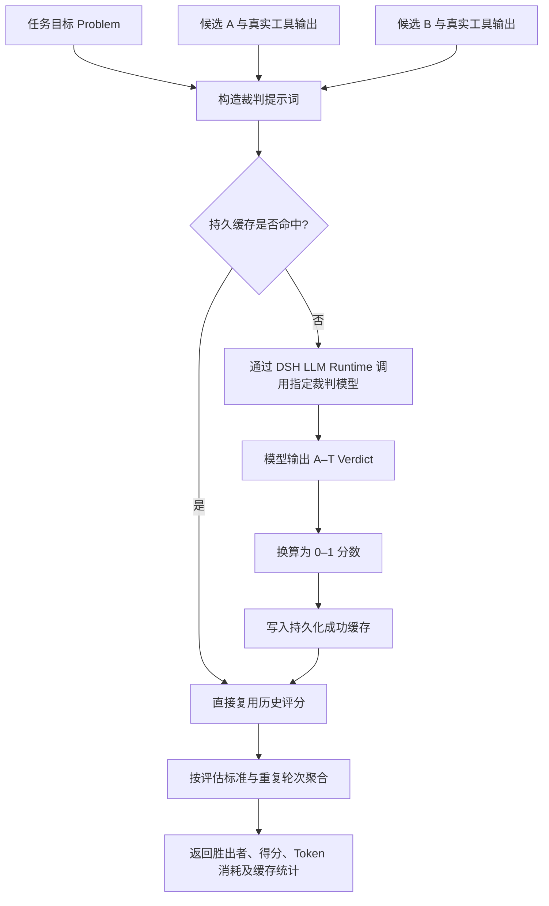
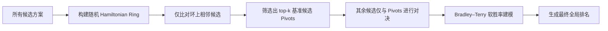

# DSH LLM Verifier

> 基于 [llm-as-a-verifier/llm-as-a-verifier](https://github.com/llm-as-a-verifier/llm-as-a-verifier) 迁移构建的 DSH 原生模型可配置复核插件（Verifier）。

---

## 它是什么？

`dsh-llm-verifier` 为 DeepSeek Harness（DSH）引入了一套**独立的裁判复核机制**。在主 Agent 负责生成代码、执行命令与工具交互的同时，Verifier 会收集当前任务目标、各候选方案过程以及真实的终端执行结果，交由你在设置中指定的独立 DSH 模型进行仲裁：评估哪个方案更可靠、当前任务的实际完成进度、以及是否存在未发现的潜在错误。

只有在主动调用以下工具时，插件才会向裁判模型发起请求：

- `verifier_compare`：对两个候选执行过程进行成对比较（Pairwise Comparison）；
- `verifier_select`：在多个候选方案中通过锦标赛机制选出最优解；
- `verifier_track`：评估任务在不同检查点（Checkpoint）的完成度与进展；
- `verifier_current_session`：显式提取当前 DSH 会话记录，进行脱敏并执行复核。

## 迁移来源

本插件的核心评估理论、A–T 评分标尺、进度判定算法以及概率基准锦标赛（Probabilistic Pivot Tournament）均源自开源项目：

- **上游项目**：[llm-as-a-verifier/llm-as-a-verifier](https://github.com/llm-as-a-verifier/llm-as-a-verifier)

本插件将上游算法完整移植为 TypeScript 实现，并深度集成了 DSH 的模型路由、设置面板、附件管理、会话日志与工具生态。上游实现作为本插件的算法基准；本仓库内置了 Python / TypeScript 一致性测试（Parity Tests），确保核心评分与锦标赛赛制（Tournament Fixture）的跨语言逻辑完全一致。

## 核心原理

可以将整体协作模式理解为 **“选手 + 裁判”**：

1. **主 Agent（选手）**：专注于具体任务的执行（编写代码、运行命令、执行单元测试）；
2. **Verifier（现场记录）**：收集题目要求、候选代码/解答及真实的终端输出证据；
3. **独立模型（裁判）**：在 DSH 设置中自由选择可用模型担任裁判；
4. **输出判定**：裁判必须在 **A–T** 细粒度标尺中给出明确的判定（Verdict）；
5. **分数换算与聚合**：插件将字母判定换算为 0–1 区间的分数，并在多个评判维度、重复轮次以及交换位置后取加权平均；
6. **多候选优化**：在多候选方案场景下启用 Pivot Tournament 算法，避免高成本的全量两两比对。

### 一次成对比较的完整流程



### 如何消除位置偏见（Position Bias）？

大语言模型通常存在“首位偏好（First-token Bias）”或对特定选项标签的偏置。为此，插件默认在每个评判标准下进行两轮对决：

```text
第 1 轮：候选 A 放置于左侧，候选 B 放置于右侧
第 2 轮：候选 B 放置于左侧，候选 A 放置于右侧
最 终：将第 2 轮结果还原至原始候选身份后，与第 1 轮计算平均得分
```

通过位置对称交换与结果求平均，最大程度抵消模型的位置偏置干扰。

### A–T 细粒度标尺说明

在成对比较（Pairwise）中，标尺定义如下：

```text
A       = 明确、完整、有确凿证据证明成功
B ... J = 置信度依次递减，但整体偏向成功
K ... S = 偏向失败的程度依次递增
T       = 明确且无可争议的失败
```

字母按等距标尺线性映射到 `[0, 1]` 区间。在打分计算上，插件采用**自适应评分机制**：

- **优先概率期望评分**：若当前模型路由为官方 `deepseek-official` 或显式配置了兼容 OpenAI Chat Completions 且支持 `top_logprobs` 的端点，插件将基于 A–T 候选 Token 的完整概率分布计算加权期望值；
- **自适应降级显式标签**：若当前路由不支持、供应商拒绝返回 `logprobs`，或响应中缺失 Token 概率，则平滑回退至模型最终输出的 A–T 显式标签。
- *原则：插件不会仅凭供应商或模型名称预设其能力，始终以运行时实际响应结果为准。*

> [!NOTE]
> 在**进度追踪（`verifier_track`）**中，字母方向相反：`A` 代表“确定尚未完成”，`T` 代表“几乎确定已完成”，再按规则映射为 `[0, 1]` 的完成度概率。

## 多候选方案：为什么不采用全量两两比对？

对 $N$ 个候选方案进行全量比对（All-Pairs Tournament）需要进行约 $\frac{N(N - 1)}{2}$ 场对决，API 调用量呈二次方（$O(N^2)$）爆炸式增长。

插件引入了上游的 **Probabilistic Pivot Tournament（概率基准锦标赛）**：



比对复杂度显著降低至接近 $O(Nk)$（其中 $k \ll N$）。候选方案越多，节省的 API 请求与 Token 成本越明显。

## 配置项说明

在 DSH 中打开：`设置 → LLM Verifier`。

| 配置项 | 说明 |
|---|---|
| **供应商 (Provider)** | 从 DSH 当前已配置且可路由的 Provider 列表中选择 |
| **模型 (Model)** | 从所选 Provider 的模型目录中指定具体裁判模型 |
| **推理强度 (Reasoning Effort)** | 使用 Adapter 为该模型声明的思考强度，或保留模型默认值 |
| **最大输出 Token** | 单次裁判请求的输出 Token 上限 |
| **最大并发数** | 所有 Verifier 调用共享的全局并发请求限制 |
| **最大重试次数** | 遇到偶发网络或服务短暂故障时的额外重试次数 |
| **请求超时 (ms)** | 单次模型调用的毫秒级超时时间 |
| **缓存条目上限** | 成功评分持久化缓存的最大容量条目数 |
| **输入/输出价格** | 仅用于本地估算单次裁判产生的费用（`estimatedCostUsd`） |

> [!NOTE]
> **多模态与图片支持**：若选定的裁判模型不支持图像输入，传入图片时将由对应 DSH Adapter 明确报错拦截，插件绝不会静默丢弃图片证据。

## 缓存、重试与遥测统计

- **持久化缓存**：成功的评分结果将基于 SHA-256 哈希值进行持久化缓存。Key 的计算维度包含：Provider、Model、任务描述、候选内容、评审标准、轮次编号、参数配置及图片摘要。失败或被取消的请求不会写入缓存。
- **并发请求合并**：相同的并发比对请求会自动共用在途 Promise（In-flight Deduplication），避免重复调用。
- **运行统计与监控**：每次调用返回完整的统计信息，涵盖实际请求次数、重试次数（Retries）、各类 Token 消耗（输入/缓存命中/输出/推理 Token）、缓存命中与未命中次数（Cache Hits/Misses）以及费用估算；其中：
  - `topLogprobScores`：采用概率分布期望计算的评分次数；
  - `explicitTagScores`：降级采用模型显式输出标签的评分次数。
- **能力记忆**：当某个 Provider/Model 明确拒绝 `logprobs` 参数后，插件进程会记住该能力探测结果，避免后续每次调用重复报错。

## 隐私与数据安全边界

`verifier_current_session` 工具**仅在被显式调用时**才会读取当前 DSH 会话内容：

- **提取范围**：仅提取直接的用户消息、Assistant 回复、工具调用（Tool Call）及实际工具执行结果（Tool Result）；自动排除插件和系统内置指令（Plugin/System Instructions）；
- **敏感信息脱敏**：默认对常见 Bearer Token、API Key、通用 Token、Password 及 Secret 进行脱敏替换；
- **灵活控制**：支持指定提取的消息序号范围、字符长度截断上限以及自定义正则表达式脱敏规则；
- **数据流向**：提取并脱敏后的上下文仅会发送给你在设置面板中指定的裁判模型。

> [!IMPORTANT]
> 默认脱敏规则不能替代全面的数据防泄漏（DLP）策略。在处理高度敏感的任务时，建议主动限制提取范围并补充自定义脱敏正则表达式。

## 自动概率评分机制 (Automatic Probability Scoring)

插件默认优先请求 `top_logprobs: 20`。它通过读取判定标签后第一个 Token 的 A–T 候选分布，经重新归一化后计算得分期望值。仅在当前路由通道无法提供概率分布时，才降级使用模型生成的最终文本标签。

- **支持直接透传 logprobs 的通道**：官方 `deepseek-official` 路由，以及在 DSH `llm-pi-ai` 中明确声明 `api: openai-completions` 且使用 HTTPS `baseURL` 的路由；
- **回退通道**：其他私有 Adapter 则通过标准 DSH Stream 稳定回退到显式标签模式。

结果中的模式计数使插件行为完全透明可观测，而非静默假设所有模型都具备概率输出能力。

### 验证评分模式

使用一个不会命中历史缓存的新问题并设置 `repeats: 1`。运行 `verifier_compare` 后观察返回的 `stats`：

```json
{
  "stats": {
    "topLogprobScores": 3,
    "explicitTagScores": 0
  }
}
```

默认包含 3 个评判标准（Criteria），因此在完全支持概率期望的模型上通常为 `3 / 0`；在不支持 logprobs 的模型上通常为 `0 / 3`。当不同标准或并发探测遇到服务商策略差异时，也可能呈现混合数值。缓存键已经过版本升级，旧的纯标签缓存不会被误用为新的自动策略结果。

## 上游授权与致谢

本插件的核心思想与算法实现移植自开源项目 [llm-as-a-verifier/llm-as-a-verifier](https://github.com/llm-as-a-verifier/llm-as-a-verifier)。上游项目在其 `LICENSE` 与 `pyproject.toml` 中明确采用 **MIT License**，原始版权声明如下：

> Copyright (c) 2026 llm-as-a-verifier

```text
The MIT License permits use, copying, modification, merging, publication,
distribution, sublicensing, and sale, provided that the copyright and
permission notices are preserved in copies or substantial portions. The
software is provided “AS IS”, without warranty. See the upstream LICENSE
for the complete legal text.
```

衷心感谢上游项目的作者及贡献者开源了细粒度 A–T 奖励机制、Token 对数概率期望打分、任务进度验证、Bradley–Terry 软胜率模型以及 Probabilistic Pivot Tournament 锦标赛算法。本 DSH 插件将这一系列优秀成果移植并深度整合至 TypeScript 与 DeepSeek Harness 生态中；本插件不对上述理论算法声明原创所有权。
