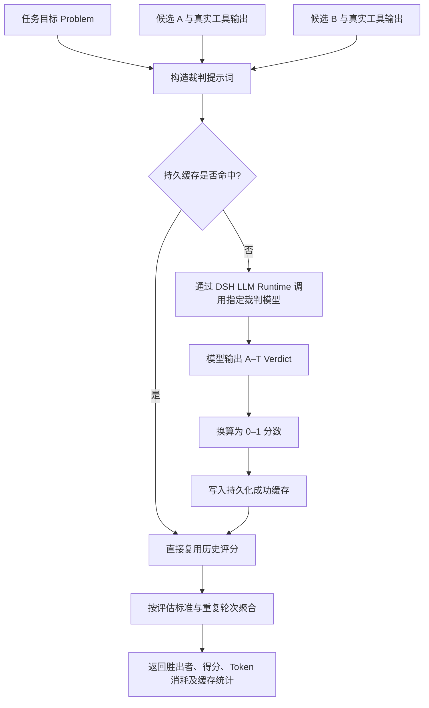

# DSH LLM Verifier

> 基于 [llm-as-a-verifier/llm-as-a-verifier](https://github.com/llm-as-a-verifier/llm-as-a-verifier) 迁移构建的 DSH 原生模型可配置复核插件（Verifier）。

---

## 它是什么？

`dsh-llm-verifier` 为 DeepSeek Harness（DSH）引入了一套**独立的裁判复核机制**。在主 Agent 负责生成代码、执行命令与工具交互的同时，Verifier 会收集当前任务目标、各候选方案过程以及真实的终端执行结果，交由你在设置中指定的独立 DSH 模型进行仲裁：评估哪个方案更可靠、当前任务的实际完成进度、以及是否存在未发现的潜在错误。

插件提供四个显式工具，并支持可配置的宿主级自动会话验收：

- `verifier_compare`：对两个候选执行过程进行成对比较（Pairwise Comparison）；
- `verifier_select`：在多个候选方案中通过锦标赛机制选出最优解，供 Best-of-N / 多候选编排器直接调用；
- `verifier_track`：评估任务在已有检查点（Checkpoint）的完成度与进展，供 Goal / Workflow 等长任务编排器直接调用；
- `verifier_current_session`：显式提取当前 DSH 会话记录，进行脱敏并执行复核；
- **四工具自动路由**：智能或严格策略在 `agent/turn-stopping` 生命周期边界按阶段调度 `select → compare → track → current_session`。第一阶段只信任 Workflow 的版本化候选协议与发生真实变化的 Todo 快照；普通 Subagent 输出必须经第二阶段的证据引用分类，避免把不同子任务误当候选；
- **自动验收门控**：候选选择与进度检查完成后，宿主运行同一会话验收逻辑；未通过时以插件 steering 反馈要求 Agent 修复并重新验证，而不是依赖模型是否主动想起工具。

## 安装与启用 (Installation & Usage)

### 1. 使用 `dsh plugin` 安装

DeepSeek Harness（DSH）通过 profile 独立管理各个运行环境的插件依赖。请使用 `dsh plugin` 命令将插件安装至目标 profile（如 `web`）：

```bash
# 方式 A：从 npm 官方 Registry 安装（推荐）
dsh plugin --profile web add dsh-llm-verifier
```

> [!NOTE]
> `dsh plugin add` 安装成功后，DSH 会自动识别包内的 `dsh.bundle` 声明并完成插件层自动对齐（Reconcile），**无需手动修改任何配置文件**。

### 2. 启动与配置

启动 DSH Web 客户端：

```bash
dsh web
# 或
dsh --profile web
```

启动后进入前端界面，打开 **`设置 → LLM Verifier`** 即可可视化配置裁判所使用的 Provider、Model、推理强度（Reasoning Effort）、最大并发与缓存策略。

### 3. 常用管理命令

```bash
# 更新插件至最新版本
dsh plugin --profile web update dsh-llm-verifier

# 卸载插件
dsh plugin --profile web remove dsh-llm-verifier

# 查看当前 Profile 已安装的插件与依赖列表
dsh plugin --profile web list
```

### 4. 作为独立库引用（可选）

如果你在其它 TypeScript / JavaScript 项目中需要复用核心评分标尺与锦标赛算法，可直接作为普通 npm 依赖安装并引入：

```bash
pnpm add dsh-llm-verifier
```

```typescript
import {
  extractScore,
  extractProgressScore,
  bradleyTerry,
  pivotRoundPairs,
} from 'dsh-llm-verifier/core'
```

## 迁移来源

本插件的核心评估理论、A–T 评分标尺、进度判定算法以及概率基准锦标赛（Probabilistic Pivot Tournament）均源自开源项目：

- **上游项目**：[llm-as-a-verifier/llm-as-a-verifier](https://github.com/llm-as-a-verifier/llm-as-a-verifier)

本插件将上游算法完整移植为 TypeScript 实现，并深度集成了 DSH 的模型路由、设置面板、附件管理、会话日志与工具生态。上游实现作为本插件的算法基准；本仓库内置了 Python / TypeScript 一致性测试（Parity Tests），确保核心评分与锦标赛赛制（Tournament Fixture）的跨语言逻辑完全一致。

## 核心原理

可以将整体协作模式理解为 **“选手 + 裁判”**：

1. **主 Agent（选手）**：专注于具体任务的执行（编写代码、运行命令、执行单元测试）；
2. **Verifier（现场记录）**：收集题目要求、候选代码/解答及真实的终端输出证据；
3. **独立模型（裁判）**：在 DSH 设置中自由选择可用模型担任裁判；
4. **输出判定**：裁判必须在 **A–T** 细粒度标尺中给出明确的判定（Verdict）；
5. **分数换算与聚合**：插件将字母判定换算为 0–1 区间的分数，并在多个评判维度、重复轮次以及交换位置后取加权平均；
6. **多候选优化**：在多候选方案场景下启用 Pivot Tournament 算法，避免高成本的全量两两比对。

### 一次成对比较的完整流程



### 如何消除位置偏见（Position Bias）？

大语言模型通常存在“首位偏好（First-token Bias）”或对特定选项标签的偏置。为此，插件默认在每个评判标准下进行两轮对决：

```text
第 1 轮：候选 A 放置于左侧，候选 B 放置于右侧
第 2 轮：候选 B 放置于左侧，候选 A 放置于右侧
最 终：将第 2 轮结果还原至原始候选身份后，与第 1 轮计算平均得分
```

通过位置对称交换与结果求平均，最大程度抵消模型的位置偏置干扰。

### A–T 细粒度标尺说明

在成对比较（Pairwise）中，标尺定义如下：

```text
A       = 明确、完整、有确凿证据证明成功
B ... J = 置信度依次递减，但整体偏向成功
K ... S = 偏向失败的程度依次递增
T       = 明确且无可争议的失败
```

字母按等距标尺线性映射到 `[0, 1]` 区间。在打分计算上，插件采用**自适应评分机制**：

- **优先概率期望评分**：若当前模型路由为官方 `deepseek-official` 或显式配置了兼容 OpenAI Chat Completions 且支持 `top_logprobs` 的端点，插件将基于 A–T 候选 Token 的完整概率分布计算加权期望值；
- **自适应降级显式标签**：若当前路由不支持、供应商拒绝返回 `logprobs`，或响应中缺失 Token 概率，则平滑回退至模型最终输出的 A–T 显式标签。
- *原则：插件不会仅凭供应商或模型名称预设其能力，始终以运行时实际响应结果为准。*

> [!NOTE]
> 在**进度追踪（`verifier_track`）**中，字母方向相反：`A` 代表“确定尚未完成”，`T` 代表“几乎确定已完成”，再按规则映射为 `[0, 1]` 的完成度概率。

## 多候选方案：为什么不采用全量两两比对？

对 $N$ 个候选方案进行全量比对（All-Pairs Tournament）需要进行约 $\frac{N(N - 1)}{2}$ 场对决，API 调用量呈二次方（$O(N^2)$）爆炸式增长。

插件引入了上游的 **Probabilistic Pivot Tournament（概率基准锦标赛）**：


比对复杂度显著降低至接近 $O(Nk)$（其中 $k \ll N$）。候选方案越多，节省的 API 请求与 Token 成本越明显。环上与 Pivot 相邻的对决不会在 Pivot 轮中重复举行——每个无序候选对全程只被评判一次，胜率统计不会被重复计权。

## 配置项说明

在 DSH 中打开：`设置 → LLM Verifier`。

| 配置项 | 说明 |
|---|---|
| **启用工具 (Enabled)** | 是否允许显式工具与自动验收向裁判模型发起请求；关闭后显式调用立即报错且自动门控不运行 |
| **调用策略** | `manual` 仅显式调用；`smart` 结构化优先，并只在有候选/检查点线索时做高置信语义路由，达到工具证据门槛后最终验收；`strict` 每个结束边界都尝试语义路由，并对任一已完成关键操作最终验收，路由或验收异常时 fail closed |
| **混合语义路由** | 结构化证据不足时，是否允许裁判模型保守分类 `compare/select/track/none`；不会生成新候选或编造检查点 |
| **语义路由置信度** | 语义识别达到该值才执行对应工具，默认 `0.9` |
| **最多候选数** | 自动 `select` 一次最多纳入的候选数，默认 `8` |
| **每任务/每会话最多路由** | 独立于最终验收预算，限制 `compare/select/track` 及语义分类的自动次数 |
| **进度完成阈值** | `track` 任一检查点低于该值时 steering 要求继续工作，默认 `0.8` |
| **单项/总证据字符上限** | 自动候选与检查点脱敏后的单项、整次路由输入硬上限，默认 `20000 / 60000` |
| **任务/会话模型调用预算** | 分类、compare/select/track 与最终验收共享的估算请求预算，默认 `48 / 160` |
| **通过阈值** | 自动会话验收要求证据分数达到阈值且胜过“未执行有效工作”基线 |
| **自动评估轮次** | 自动验收每个标准的重复轮次；默认 1，作为低成本初筛 |
| **智能模式最少工具调用** | `smart` 策略需要的最少非 Verifier 工具调用数 |
| **最大证据字符** | 自动发送给裁判的最近会话轨迹字符上限 |
| **每任务/每会话最多验收** | 防止低分反馈形成无限修复循环并限制成本 |
| **供应商 (Provider)** | 从 DSH 当前已配置且可路由的 Provider 列表中选择 |
| **模型 (Model)** | 从所选 Provider 的模型目录中指定具体裁判模型 |
| **推理强度 (Reasoning Effort)** | 使用 Adapter 为该模型声明的思考强度，或保留模型默认值 |
| **最大输出 Token** | 单次裁判请求的输出 Token 上限 |
| **最大并发数** | 所有 Verifier 调用共享的全局并发请求限制 |
| **最大重试次数** | 遇到偶发网络或服务短暂故障时的额外重试次数 |
| **请求超时 (ms)** | 单次模型调用的毫秒级超时时间 |
| **缓存条目上限** | 成功评分持久化缓存的最大容量条目数 |
| **输入/输出价格** | 仅用于本地估算单次裁判产生的费用（`estimatedCostUsd`） |

> [!NOTE]
> **多模态与图片支持**：若选定的裁判模型不支持图像输入，传入图片时将由对应 DSH Adapter 明确报错拦截，插件绝不会静默丢弃图片证据。

## 四工具自动调度

自动路由发生在 Agent **准备停止但尚未提交 `turn/end`** 的边界，四个工具不是互斥替代关系，而是覆盖不同阶段：

```text
3 个以上同组真实候选 → verifier_select → steering 实施胜出候选
恰好 2 个同组真实候选 → verifier_compare → steering 实施胜出候选
已有多个进度快照/检查点 → verifier_track → 未达阈值则 steering 继续
候选决策和进度阶段完成 → verifier_current_session → 最终交付验收
```

### 第一阶段：结构化优先

插件确定性识别以下对象，不额外调用分类模型：

- 同一个 Agent step 中完成的两个同步 `subagent` / `subagent_fork` 结果视为一个候选组；后台启动返回的 Subagent ID 不会被当作候选；
- `workflow` 只有返回以下版本化协议才会被视为可信候选；普通 JSON、裸数组及 Subagent 文本不会直接触发结构化比较：

```json
{
  "protocol": "dsh-verifier-candidates",
  "version": 1,
  "groupId": "auth-implementation",
  "candidates": [
    { "id": "jwt", "label": "JWT", "status": "completed", "content": "..." },
    { "id": "session", "label": "Session", "status": "completed", "content": "..." }
  ]
}
```

- 同一任务内至少两个内容或状态发生真实变化的 `todo/write` 快照形成进度检查点；完全相同的重复快照会被折叠。

显式调用过对应的 `verifier_compare`、`verifier_select` 或 `verifier_track` 后，自动 Router 不会再对同类结构化对象重复执行。每个输入还会计算稳定指纹，同一证据不会重复消费预算。

### 第二阶段：混合语义识别

当结构化对象不足时，启用“混合语义路由”可让配置的裁判模型只做严格 JSON 分类：`none / compare / select / track`。分类器不能返回自由文本证据，只能返回会话中已经存在且成功配对的 `tool/call` callId 或真实 `todo/write` seq；宿主再从不可变快照重新提取、脱敏和限长。额外 prose、Markdown fence、未知字段、重复/不存在的引用、非递增检查点都会 fail closed。

- `smart`：仅在会话出现 Subagent、Workflow、Goal、Todo 或“候选/方案/检查点”等明确线索时分类；
- `strict`：每个准备结束边界都分类，无法确认时返回 `none`；路由调用失败时注入 steering，阻止静默跳过；
- `manual`：结构化与语义自动路由、最终自动验收都关闭，四个工具仍可显式调用。

候选选择产生 steering 后，Agent 必须实施胜出候选；进度未达阈值也会 steering 继续。任何自动 `compare/select/track` 成功都会设置 `finalVerificationRequired`，下一停止边界即使没有传统写入类工具也必须执行 `verifier_current_session`；只有针对最新快照且达到阈值的最终验收才能清除要求。路由采用 reservation/commit/fail 状态，取消、过期或失败不会被误记为成功；strict 会维持阻断并 fail closed。

所有自动阶段共享任务/会话级模型调用预算；分类请求以 `verifier_route_classify` 单独记录到统计。候选、步骤和标签在发送前统一执行默认脱敏、单项字符上限和总字符上限，图片证据按与显式工具相同的路径传入。

## 缓存、重试与遥测统计

- **按话题持久化**：成功评分缓存与调用统计写入当前 DSH 话题的持久化目录（`~/.dsh/sessions/<workspace>/<session-id>/verifier/`）。不同话题相互隔离；永久删除话题时，该目录会随会话日志一并删除，不再在桌面或项目工作目录生成 `.dsh-verifier-cache`。
- **持久化缓存**：成功的评分结果将基于 SHA-256 哈希值进行持久化缓存。Key 的计算维度包含：完整渲染后的裁判提示词（涵盖任务描述、候选内容、评审标准与提示词模板本身）、评分通道（概率期望 / 显式标签）、Provider、Model、推理强度、输出上限、轮次编号及图片摘要。缓存按调用前预测的通道查询，但**始终按响应的实际评分通道写入**：首次调用发生中途降级（无可用路由或供应商拒绝 logprobs）时，结果会落在显式标签键下供后续调用复用，而不会被误当作概率期望评分；提示词模板变更或 logprobs 能力状态翻转都会自然失效。失败或被取消的请求不会写入缓存。
- **并发请求合并**：相同的并发比对请求会自动共用在途 Promise（In-flight Deduplication），避免重复调用。
- **运行统计与监控**：每次调用返回完整的统计信息，涵盖实际请求次数、重试次数（Retries）、各类 Token 消耗（输入/缓存命中/输出/推理 Token）、缓存命中与未命中次数（Cache Hits/Misses）以及费用估算；其中：
  - `topLogprobScores`：采用概率分布期望计算的评分次数；
  - `explicitTagScores`：降级采用模型显式输出标签的评分次数。
- **能力记忆**：当某个 Provider/Model 明确拒绝 `logprobs` 参数后，插件进程会记住该能力探测结果，避免后续每次调用重复报错。

## 隐私与数据安全边界

`verifier_current_session` 会在显式调用时读取当前 DSH 会话；启用 `smart` / `strict` 策略后，宿主也会为混合语义路由和满足证据门槛的最终验收调用同一脱敏提取路径：

- **提取范围**：仅提取直接的用户消息、Assistant 回复、工具调用（Tool Call）及实际工具执行结果（Tool Result）；自动排除插件和系统内置指令（Plugin/System Instructions）；
- **敏感信息脱敏**：默认对常见 Bearer Token、API Key、通用 Token、Password 及 Secret 进行脱敏替换；
- **灵活控制**：支持指定提取的消息序号范围、字符长度截断上限以及自定义正则表达式脱敏规则；
- **数据流向**：提取并脱敏后的上下文仅会发送给你在设置面板中指定的裁判模型。

> [!IMPORTANT]
> 默认脱敏规则不能替代全面的数据防泄漏（DLP）策略。在处理高度敏感的任务时，建议主动限制提取范围并补充自定义脱敏正则表达式。

## 自动概率评分机制 (Automatic Probability Scoring)

插件默认优先请求 `top_logprobs: 20`。它通过读取判定标签后第一个 Token 的 A–T 候选分布，经重新归一化后计算得分期望值。仅在当前路由通道无法提供概率分布时，才降级使用模型生成的最终文本标签。

- **支持直接透传 logprobs 的通道**：官方 `deepseek-official` 路由，以及在 DSH `llm-pi-ai` 中明确声明 `api: openai-completions` 且使用 HTTPS `baseURL` 的路由；
- **回退通道**：其他私有 Adapter 则通过标准 DSH Stream 稳定回退到显式标签模式。

结果中的模式计数使插件行为完全透明可观测，而非静默假设所有模型都具备概率输出能力。

### 验证评分模式

使用一个不会命中历史缓存的新问题并设置 `repeats: 1`。运行 `verifier_compare` 后观察返回的 `stats`：

```json
{
  "stats": {
    "topLogprobScores": 3,
    "explicitTagScores": 0
  }
}
```

默认包含 3 个评判标准（Criteria），因此在完全支持概率期望的模型上通常为 `3 / 0`；在不支持 logprobs 的模型上通常为 `0 / 3`。当不同标准或并发探测遇到服务商策略差异时，也可能呈现混合数值。缓存键已经过版本升级，旧的纯标签缓存不会被误用为新的自动策略结果。

## 上游授权与致谢

本插件的核心思想与算法实现移植自开源项目 [llm-as-a-verifier/llm-as-a-verifier](https://github.com/llm-as-a-verifier/llm-as-a-verifier)。上游项目在其 `LICENSE` 与 `pyproject.toml` 中明确采用 **MIT License**，原始版权声明如下：

> Copyright (c) 2026 llm-as-a-verifier

```text
The MIT License permits use, copying, modification, merging, publication,
distribution, sublicensing, and sale, provided that the copyright and
permission notices are preserved in copies or substantial portions. The
software is provided “AS IS”, without warranty. See the upstream LICENSE
for the complete legal text.
```

衷心感谢上游项目的作者及贡献者开源了细粒度 A–T 奖励机制、Token 对数概率期望打分、任务进度验证、Bradley–Terry 软胜率模型以及 Probabilistic Pivot Tournament 锦标赛算法。本 DSH 插件将这一系列优秀成果移植并深度整合至 TypeScript 与 DeepSeek Harness 生态中；本插件不对上述理论算法声明原创所有权。